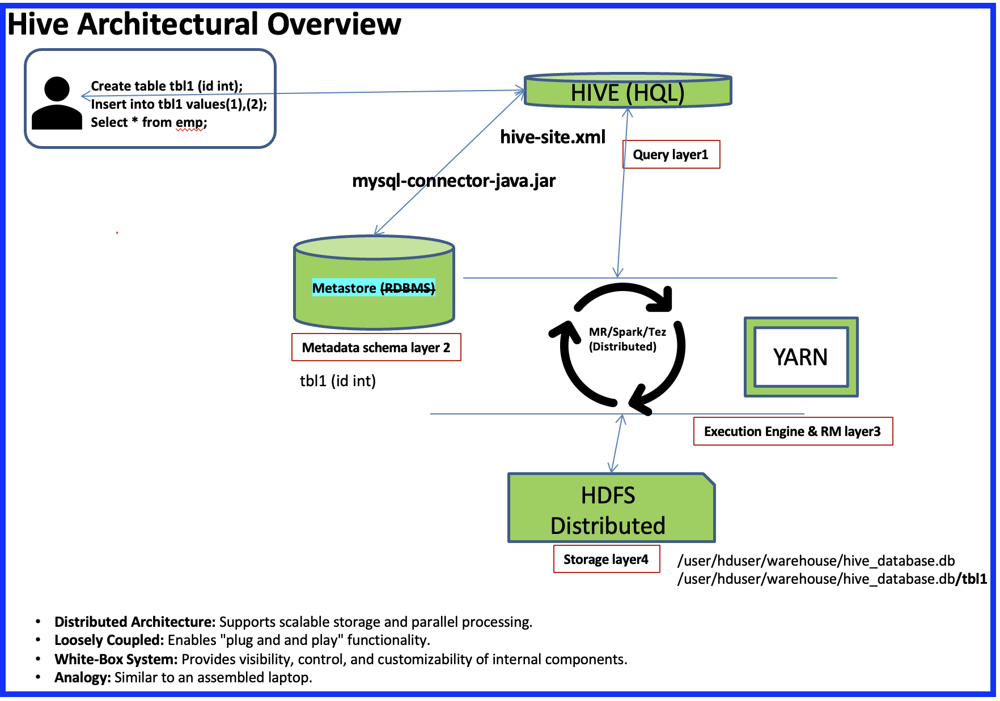
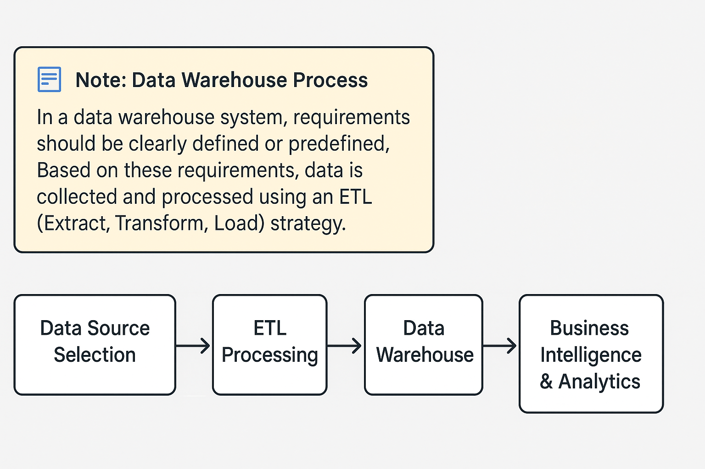
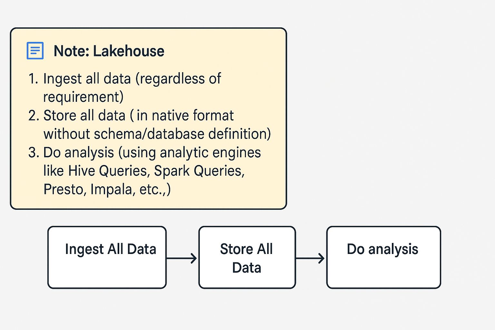

# 🐝 Hive Overview

Apache Hive is a **data warehouse (DWH) and SQL layer** built on top of the Hadoop ecosystem.  
It provides a familiar SQL-like interface (**HiveQL**) to query and analyze large datasets stored in **HDFS** (Hadoop Distributed File System).

- **Storage:** Uses HDFS or cloud object storage (S3, GCS, ADLS) for storing raw and processed data.
- **Processing:** Supports various execution engines:
  - **MapReduce (MR):** Original engine; reliable, but slower.
  - **Tez:** DAG-based engine, faster, better for iterative/interactive workloads.
  - **Spark:** In-memory processing, very fast for large analytical jobs.
- **Metadata/Metastore:** Stores tables, partitions, columns, etc., typically backed by MySQL, PostgreSQL, or Oracle.

  
 Click to view the Hive Architecture Overview 

  

---

## 🌟 Why Learn Hive?

Hive builds a foundation to learn other distributed SQL engines and cloud data warehouses:
- Presto
- Impala
- Hive on MR / Tez / Spark
- BigQuery
- Athena
- Synapse (Azure)

Hive helps:
- Build **Lakehouse architectures** (combining raw storage with curated layers).
- Add SQL access, governance, and metadata to Hadoop’s **Data Lake**.

**Typical roles:**
- **Data Engineers:** Data curation, ETL/ELT pipelines.
- **Data Analysts:** Exploratory analysis and reporting.

---

## 🏛 Hive Layers & Components

| Layer         | Hive Component                          | Traditional Equivalent                     | Purpose                                                                               |
|--------------|-----------------------------------------|--------------------------------------------|--------------------------------------------------------------------------------------|
| Layer 1      | SQL Layer                               | ORACLE SQL / HiveQL                       | Querying, data manipulation, user interface                                           |
| Layer 2      | Metadata Layer                          | RDBMS Metastore                           | Stores schemas, partitions, lineage, governance                                      |
| Layer 3      | Processing Layer                         | ORACLE Engine / YARN / Tez / Spark        | Distributed query execution                                                          |
| Layer 4      | Storage Layer                           | Filesystem / HDFS                         | Stores raw & processed data in formats like ORC, Parquet, Avro, CSV, JSON            |

This architecture makes Hive modular, fault-tolerant, and scalable.

---

## ⚙️ Capabilities & Strengths

1. **Lakehouse on top of Datalake:**  
   - Works on raw storage (HDFS/S3/GCS/ADLS) with schemas & governance.
   - Supports structured, semi-structured, and unstructured data.

2. **Supports ELT & ETL:**  
   - ELT: Load raw data first, transform later.
   - ETL: Transform data before loading curated tables.

3. **Optimized for high throughput:**  
   - Great for batch analytics and historical data.
   - Low latency possible using Spark/Tez.

4. **Flexible transformation:**  
   - Data type conversions, regex, window functions, UDFs.
   - Schema-on-read for raw data.

5. **Iterative workloads:**  
   - Refine queries, transformations, and schemas until business goals are met.

6. **Partial ACID compliance:**  
   - Supports basic transactions in ORC tables (Hive 3.x+).
   - Limited compared to full DML/TCL in RDBMS.

7. **Structured & semi-structured data:**  
   - JSON, XML, Avro, Parquet, ORC, etc.

8. **Excellent for large-scale historical analytics:**  
   - Partitioning, bucketing, advanced file formats.

---

## 📊 DB vs Hive: Architecture & Characteristics

| Feature                | DB / Data Warehouse (DW)                                              | Hive (on Hadoop)                                                                            |
|-----------------------|------------------------------------------------------------------------|---------------------------------------------------------------------------------------------|
| **Architecture**     | Non-distributed but supports parallelism                                 | Distributed; parallelism in storage & processing                                            |
| **Coupling**         | Tightly coupled (monolithic)                                            | Loosely coupled; components can be swapped/plugged                                          |
| **Transparency**     | Blackbox (internal logic hidden)                                       | Whitebox (can inspect and modify internal components)                                       |

---

## ⚡ Latency vs Throughput

| Metric        | Explanation                                                                                                   |
|--------------|-----------------------------------------------------------------------------------------------------------------|
| **Latency**   | Time to process small data volumes; e.g., quick single-row queries.                                            |
| **Throughput**| Volume of data processed in a fixed time; e.g., processing TBs of data in batch workloads.                    |

---

## 🔧 HQL vs DB/DW SQL

| Feature                         | Hive (HQL)                                                   | DB / DW SQL                                                       |
|--------------------------------|--------------------------------------------------------------|------------------------------------------------------------------|
| **ETL / ELT**                  | Supports both ELT & ETL                                      | Mainly ETL                                                        |
| **Latency / Throughput**       | High latency / high throughput; can be low latency with Spark/Tez | Low latency / lower throughput                                    |
| **Parsing strategy**           | Query time parsing (ELT) & load time parsing (ETL)           | Load time parsing (ETL)                                          |
| **Transformation timing**      | Transform at query time                                      | Transform before loading                                         |
| **Data support**               | Structured & semi-structured                                 | Mainly structured                                                |
| **Workload type**              | Iterative workloads                                          | Defined, pre-modeled workloads                                   |
| **Example: ELT**               | Load to HDFS → create Hive table → transform later           | Transform → load into DB                                         |

---

## 🔄 Iterative vs Defined workloads

- **Iterative (Hive):** Multiple refinements to improve result quality; great for discovery.
- **Defined (DB/DW):** Predetermined schema & transformations, rarely changed.

---

## ⚙ Performance

|                    | Throughput                                      | Latency                                                                            |
|-------------------|-------------------------------------------------|-----------------------------------------------------------------------------------|
| **Hive**          | High: e.g., 100 GB in ~10 mins                  | High latency (MR): 10 rows → 1 min; Low latency (Spark/Tez): 10 rows → ~2 sec      |
| **DB / DW**       | Lower: e.g., 100 GB in ~20 hours                | Low latency: 10 rows → < 1 sec                                                     |

✅ *Parsing: converting semi-structured → structured.*

---

## 🐝 Hive: Good For vs Not Good For

| Hive is Good For | Hive is Not Good For |
|------------------|----------------------|
| ✅ ELT/ETL, analytics, iterative workloads, batch jobs, high throughput | ❌ OLTP replacement; lacks full ACID (TCL) |
| ✅ 360° data analysis, reporting over big data | ❌ Small datasets or row-level inserts |
| ✅ Declarative SQL | |
| ✅ Supplementary Lakehouse layer | ❌ Direct replacement of transactional DBs |
| ✅ Historical data processing | ❌ Live real-time streaming (single inserts create new HDFS files) |

---

## 📦 DataWarehouse Process vs LakeHouse Process

|   |   |
|------------------|----------------------|

---
# Summary

* **📊 Data Storage & Processing**
    * 💾 Scalable Storage (Distributed)
    * ✨ Parallel Processing
    * ⏱️ Batch Processing
    * 🔄 ETL (Extract, Transform, Load) Operations

* **🔍 Querying & Analysis**
    * ✍️ SQL-like Interface (HiveQL)
    * ✅ Supports Standard SQL Functions
    * ➕ User-Defined Functions (UDFs)
    * 🧩 Complex Data Types (Arrays, Maps, Structs)
    * 📈 Integration with BI Tools

* **🏗️ Architecture & Design**
    * 🐘 Built on Hadoop Ecosystem (HDFS, YARN, MapReduce/Tez/Spark)
    * 📚 Metastore (Schema, Table Definitions)
    * 💻 Driver (CLI, JDBC/ODBC)
    * ⚙️ Execution Engines (MapReduce, Tez, Spark)
    * 🔌 Loosely Coupled / Plug-and-Play

* **🚀 Performance & Optimization**
    * ➡️ Partitioning
    * 🧺 Bucketing
    * 🧠 Cost-Based Optimizer (CBO)
    * ⚡ Vectorization
    * 💨 Caching (e.g., LLAP for Tez)
    * ⚡ Materialized Views (HPL)

* **🔒 Security & Governance**
    * 🔑 Authentication (Kerberos)
    * 👮 Authorization (SQL Standard Based)
    * 📏 Row-level / Column-level Security
    * 🎭 Data Masking
    * 📋 Auditing

* **🗄️ Data Formats**
    * 📁 Supports Various Formats
        * 📄 Text (CSV, TSV)
        * 📦 SequenceFile
        * 🗂️ RCFile
        * 📊 ORC (Optimized Row Columnar)
        * 📈 Parquet (Columnar)
    * 🤏 Compression Support

* **🔗 Integration**
    * 🌐 Hadoop Ecosystem (HDFS, YARN)
    * 🔥 Spark
    * 🚀 HBase
    * 💬 Kafka
    * 🗄️ RDBMS (via Sqoop)
    * 🛠️ Various Tools (BI, Machine Learning)

* **🔧 Extensibility (White-Box)**
    * 🔄 Custom SerDe (Serializer/Deserializer)
    * 📂 Custom File Formats
    * ➕ Custom UDFs/UDAFs/UDTFs
    * 🤝 Integration with external systems

---
