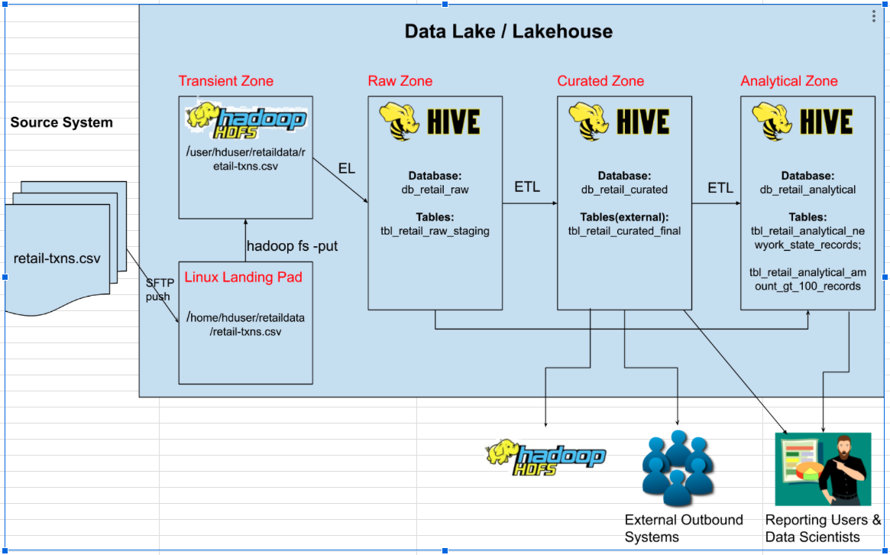

# Hive Retail Data Pipeline: Raw → Curated → Analytical

<details>
  <summary> Click to view the Datalake/House Architecture </summary>
  
</details>


## 1. Create Landing Pad

**Landing pad creation:**

```bash
mkdir /home/hduser/retaildata
cp txns /home/hduser/retaildata/retail-txns.csv
```

**Sample data:**

```
00000000,06-26-2011,4007024,040.33,Exercise & Fitness,Cardio Machine Accessories,Clarksville,Tennessee,credit
00000001,05-26-2011,4006742,198.44,Exercise & Fitness,Weightlifting Gloves,Long Beach,California,credit
```

**Data Discovery (column headers):**

```
record_id, transaction_date, customer_id, amount, sports_category, sports_type, city, state, payment_type
```

---

## 2. Copy Data to Transient/Zone

```bash
hadoop fs -rm -r /user/hduser/retaildata
hadoop fs -mkdir /user/hduser/retaildata
hadoop fs -put -f /home/hduser/retaildata/retail-txns.csv /user/hduser/retaildata/retail-txns.csv
```

---

## 3. Create Retail Databases

```sql
drop database if exists db_retail_raw cascade;
drop database if exists db_retail_curated cascade;
drop database if exists db_retail_analytical cascade;

create database if not exists db_retail_raw 
comment 'retail raw database' 
location '/user/hduser/db_retail_raw' 
with dbproperties ('created_by' = 'murali', 'when created' = '08-JAN-2025');

create database if not exists db_retail_curated 
comment 'retail curated database' 
location '/user/hduser/db_retail_curated' 
with dbproperties ('created_by' = 'murali', 'when created' = '08-JAN-2025');

create database if not exists db_retail_analytical 
comment 'retail analytical database' 
location '/user/hduser/db_retail_analytical' 
with dbproperties ('created_by' = 'murali', 'when created' = '08-JAN-2025');

desc database db_retail_raw;
desc database db_retail_curated;
desc database db_retail_analytical;
```

---

## 4. Create Tables and Pipeline

### 🔹 Raw Zone

```sql
create table db_retail_raw.tbl_retail_raw_staging (
  record_id int, 
  transaction_date string, 
  customer_id int, 
  amount double, 
  sports_category string, 
  sports_type string, 
  city varchar(300), 
  state varchar(300), 
  payment_type varchar(300)
)
row format delimited 
fields terminated by ',' 
location '/user/hduser/retaildata';

select * from db_retail_raw.tbl_retail_raw_staging limit 5;
```

---

### 🔹 Curated Zone

> *External table so other systems can access.*

```sql
hadoop fs -rm -r /user/hduser/retaildata_curated

create external table db_retail_curated.tbl_retail_curated_final (
  record_id int, 
  transaction_date date, 
  customer_id int, 
  amount double, 
  sports_category string, 
  sports_type string, 
  city varchar(300), 
  state varchar(300), 
  payment_type varchar(300)
)
row format delimited 
fields terminated by '|' 
location '/user/hduser/retaildata_curated';

insert into db_retail_curated.tbl_retail_curated_final (
  record_id, transaction_date, customer_id, amount, sports_category, sports_type, city, state, payment_type
)
select 
  record_id, 
  cast(to_date(from_unixtime(unix_timestamp(transaction_date, 'MM-dd-yyyy'))) as date), 
  customer_id, 
  amount, 
  sports_category, 
  sports_type, 
  city, 
  state, 
  payment_type 
from db_retail_raw.tbl_retail_raw_staging;

select * from db_retail_curated.tbl_retail_curated_final limit 5;
```

---

### 🔹 Analytical Zone

#### 1. New York State Records (ORC format)

```sql
create table db_retail_analytical.tbl_retail_analytical_newyork_state_records 
stored as orc 
as select * from db_retail_curated.tbl_retail_curated_final where state='New York';

select * from db_retail_analytical.tbl_retail_analytical_newyork_state_records limit 5;
```

#### 2. Amount > 100 Records

```sql
create table db_retail_analytical.tbl_retail_analytical_amount_gt_100_records 
as select * from db_retail_curated.tbl_retail_curated_final where amount > 100;

select * from db_retail_analytical.tbl_retail_analytical_amount_gt_100_records limit 5;
```

#### 3. Amount < 100 Records (Workaround for External Table)

```sql
create external table db_retail_analytical.tbl_retail_analytical_amount_lt_100_records 
like db_retail_curated.tbl_retail_curated_final;

insert into db_retail_analytical.tbl_retail_analytical_amount_lt_100_records 
select * from db_retail_curated.tbl_retail_curated_final where amount < 100;

select * from db_retail_analytical.tbl_retail_analytical_amount_lt_100_records limit 5;

describe formatted db_retail_analytical.tbl_retail_analytical_amount_lt_100_records;

alter table db_retail_analytical.tbl_retail_analytical_amount_lt_100_records 
set tblproperties('EXTERNAL'='FALSE');
```

---

### 🔸 Analytical Reports

#### a. Sports Category-wise Sales Report

```sql
select sports_category, sum(amount) total_amount 
from db_retail_curated.tbl_retail_curated_final 
group by sports_category;
```

#### b. Save Report to HDFS

```bash
hadoop fs -mkdir /user/hduser/retaildata_analytical
```

```sql
insert overwrite directory '/user/hduser/retaildata_analytical'
row format delimited fields terminated by '|'
select sports_category, sum(amount) total_amount 
from db_retail_curated.tbl_retail_curated_final 
group by sports_category;
```

```bash
hadoop fs -cat /user/hduser/retaildata_analytical/*
```

#### c. Save Report to Local File System

```bash
mkdir /home/hduser/retaildata_analytical
```

```sql
insert overwrite local directory '/home/hduser/retaildata_analytical'
row format delimited fields terminated by '|'
select sports_category, sum(amount) total_amount 
from db_retail_curated.tbl_retail_curated_final 
group by sports_category;
```

```bash
cat /home/hduser/retaildata_analytical/*
```

---

## 5. Cleanup (Optional)

> Since it is a managed table, it drops both metadata and data.

```sql
drop table db_retail_raw.tbl_retail_raw_staging;
```
