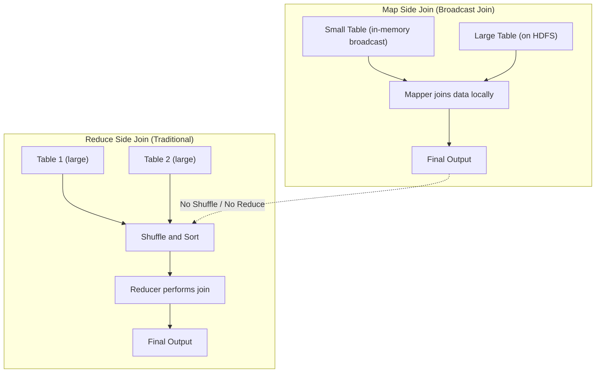

## Q1. Important considerations before performing Hive query performance tuning:

### **1. Table Design & Storage Considerations**

Before tuning, understand how your table is created:

* **Storage format:** Text, ORC, Parquet, Avro, RCFile, etc.
* **Compression:** Is compression enabled (SNAPPY, ZLIB, GZIP)?
* **Partitioning:** Helps prune unnecessary data.
* **Bucketing:** Useful for efficient joins and sampling.

### **2. Gather Table Statistics**

Manual observation and metadata collection help guide optimizations:

* **Data growth rate:** How fast the table size is increasing.
* **Table size & column types:**

  * Example: Large textual columns like chat/call transcripts or narrative feedback (~1.5 GB) might impact performance.
  * **Vectorization:** Avoid reading too many rows at once for heavy textual data (default 1024 rows).
  * **Sqoop fetch size:** Optimize while importing data.
* **Number of columns & rows:**

  * For wide tables, consider **columnar formats** like ORC or Parquet.
* **Cardinality of columns:** Helps decide partitions and buckets for efficient query execution.

### **3. Query Patterns & Clauses**

Understanding your query patterns helps pick optimizations:

* **Inline queries or CTEs**
* **WHERE clauses:** Prefer partition filters for pruning.
* **Joins:** Use bucketing to improve performance on large tables.
* **Aggregations / GROUP BY / HAVING / ORDER BY / LIMIT**
* **Set operations:** UNION / INTERSECT

### **4. Data Writing Considerations**

* **Frequency:** One-time load vs. regular batch loads.
* **Serialization format:** Avro, JSON, Text, ORC, Parquet, RCFile.
* **Compression:** Choose a format that balances read/write speed (e.g., ORC/Parquet with SNAPPY).
* **Reading efficiency:** Columnar formats + compression improve scan times.

### **5. Logging & Monitoring**

* Introduce **logger tables** to capture:

  * Execution time
  * Status of HQL statements
  * Helps identify slow steps in pipelines

### **6. Execution Plan Analysis**

* Use **EXPLAIN** to understand Hive query execution:

  * Join strategy (MapJoin, SortMergeJoin, etc.)
  * Whether **predicate pushdown** or other optimizations are applied

### **7. Environment & Configuration Settings**

Tune both default and query-specific settings:

* **Execution engine:** MR vs. Tez vs. Spark
* **Join types:** Broadcast vs. MapJoin
* **Reducers:** Count, split size, number of reducers
* **CBO (Cost-Based Optimizer)**
* **Vectorization** and parallel execution
* **Heap memory & other JVM settings**

### **Key Takeaways**

* Performance tuning starts **before writing queries**—it’s about understanding **table design, data size, query patterns, and environment settings**.
* Use **columnar formats, compression, partitions, and bucketing** strategically.
* Always validate with **EXPLAIN** and **execution logs** before finalizing optimizations.

---

## Q2. Hive common interview questions:

### **1. Hive MR vs Impala vs Tez**

| Feature          | Hive MR                     | Hive Tez          | Impala                               |
| ---------------- | --------------------------- | ----------------- | ------------------------------------ |
| Execution engine | MapReduce                   | Tez DAG           | Native MPP engine                    |
| Latency          | High                        | Medium            | Low (real-time queries)              |
| Throughput       | Good for batch              | Faster than MR    | High throughput, interactive queries |
| Use case         | Batch processing, large ETL | Faster batch jobs | Interactive analytics, BI dashboards |
| Integration      | Hadoop ecosystem            | Hadoop ecosystem  | Hadoop ecosystem (HDFS)              |

> **Key takeaway:** MR is slow, Tez faster batch, Impala low-latency interactive queries.

### **2. Manually added partition folder not fetched**

* Hive doesn’t automatically recognize new folders.
* **Solutions:**

  * `ALTER TABLE table_name ADD PARTITION (partition_col='value') LOCATION 'path';`
  * **Fool-proof:** `MSCK REPAIR TABLE table_name;`

> **MSCK repair** scans the table location and automatically adds all missing partitions.

### **3. When to choose partitioning & bucketing**

* **Partitioning:**

  * Use when a column has **high cardinality and is often filtered** (`WHERE partition_col=value`).
  * Reduces data scanned → faster queries.
* **Bucketing (sorted buckets):**

  * Use when performing **joins or aggregations** on columns.
  * Improves performance by **reducing shuffle**, enabling **bucketed joins**.
* **Example:**

  ```sql
  CREATE TABLE sales(
      id INT,
      product STRING,
      amount FLOAT
  )
  PARTITIONED BY (year INT)
  CLUSTERED BY (product) INTO 8 BUCKETS
  STORED AS ORC;
  ```

### **4. AVRO vs PARQUET vs ORC**

| Feature          | AVRO                            | Parquet        | ORC                                    |
| ---------------- | ------------------------------- | -------------- | -------------------------------------- |
| Format           | Row-oriented                    | Columnar       | Columnar                               |
| Compression      | Supports                        | Supports       | High compression                       |
| Schema evolution | Easy                            | Moderate       | Moderate                               |
| Performance      | Good for writes                 | Good read/scan | Best for Hive, vectorized read         |
| Use case         | ETL pipelines, schema evolution | Analytics & BI | Hive batch queries, heavy aggregations |

> **Key takeaway:** Use ORC/Parquet for analytics; AVRO when schema evolution is needed.

### **5. Performance improvement in Hive**

* Use **columnar storage** (ORC/Parquet)
* **Partitioning** & **bucketing**
* Enable **vectorization**
* Use **Tez execution engine** instead of MR
* **Predicate pushdown** (filter early)
* Avoid **small files**, use **merge**
* Use **map-side joins** (for small tables)
* Use **CBO (Cost-Based Optimizer)**
* Proper **heap & reducer tuning**

### **6. Table streaming / stream table concept in joins**

* **Idea:** When joining tables, small tables can be **streamed into memory** (hash table)
* **Best practice:**

  * Stream the **smaller table**
  * Larger table is scanned sequentially
* **Hash table:** Used to avoid skew and allow **map-side joins**

> Helps in **avoiding shuffle** and improving join performance.

### **7. Hive Index**

* **Concept:** An index table stores **pointers/addresses** to original data rows for faster lookup.
* **Performance:**

  * Reduces scan of entire table for **filtering operations**.
  * Mostly useful for selective queries.
* **Caveats:**

  * Hive Indexing deprecated from Hive 3.0 onwards.
  * **Alternative:** Materialized views or **ORC/Parquet**, which inherently support **column pruning and indexing**.

---

## Q3. Performance considerations when loading dynamic partitions in Hive, using your example and insights:

### **1. Problem with naive dynamic partition insert**

Example:

```sql
INSERT INTO TABLE abc PARTITION(data_dt)
SELECT * FROM src;
```

* Works for **few partitions**.
* **Side effects when loading many partitions** (e.g., 1 year = 365 days):

  1. **Huge number of small files** → slows down downstream jobs.
  2. **Too many mappers/reducers** → high overhead.
  3. **Out of memory issues** in mappers or reducers (parallel writers).
  4. **Data skew** → some reducers get more data (hotspot), others are underutilized.

### **2. Recommended approach**

#### **Step 1: Control the number of mappers/reducers**

```sql
SET mapred.map.tasks=37;
SET mapred.reduce.tasks=37;
```

* Ensures **controlled parallelism**, avoids excessive small files and OOM.

#### **Step 2: Distribute data by partition key**

```sql
INSERT INTO TABLE abc PARTITION(data_dt)
SELECT * 
FROM src
DISTRIBUTE BY data_dt;
```

* `DISTRIBUTE BY data_dt` ensures:

  * **Reducer writes data for specific partition(s)**.
  * Mitigates **skewness** by evenly distributing workload.
  * Equivalent to **hash(data_dt) % num_reducers**.

> Example: If each date has 10 MB, 37 reducers → ~10 dates per reducer.

#### **Step 3: Handle larger datasets (e.g., 10 years)**

* Instead of creating 1 reducer per partition, you can use **fewer reducers**:

  * One reducer may write multiple partitions.
* This reduces **overhead from too many small files**.

### **3. Common challenges and solutions**

| Challenge                  | Solution                                                           |
| -------------------------- | ------------------------------------------------------------------ |
| Huge number of small files | Use controlled reducers + ORC/Parquet for compression              |
| OOM in mappers/reducers    | Reduce parallelism, use columnar format, increase memory if needed |
| Data skew / hot partition  | Use `DISTRIBUTE BY partition_key` to evenly spread partitions      |
| Slow upstream jobs         | Avoid creating hundreds of tiny files per partition                |

### **4. Key Recommendations**

1. Always use **`DISTRIBUTE BY partition_key`** in dynamic partition inserts.
2. Use **ORC/Parquet** to reduce file size and memory overhead.
3. Tune **number of mappers and reducers** based on data size.
4. For very large datasets (years of partitions), **one reducer can write multiple partitions** to avoid excessive small files.
5. Monitor for **skew** and **OOM issues**, adjust reducer count accordingly.
6. What changes when you use DISTRIBUTE BY data_dt

  ```sql 
  INSERT INTO TABLE abc PARTITION(data_dt)
  SELECT * FROM src
  DISTRIBUTE BY data_dt;
  ```
  * Still creates 365 partitions, but:
    * Distribution is done on reduce side → each reducer is responsible for writing data for a subset of partitions.
    * Hive ensures that all rows for the same data_dt go to the same reducer.
  * This prevents multiple reducers from writing to the same partition simultaneously.
    So yes, number of partitions = number of unique data_dt values,
    but number of output files per partition and job overhead are drastically reduced.

| Problem              | Without `DISTRIBUTE BY`                    | With `DISTRIBUTE BY data_dt`              |
| -------------------- | ------------------------------------------ | ----------------------------------------- |
| Number of partitions | Same (depends on distinct data_dt)         | Same                                      |
| Small file count     | Very high (multiple writers per partition) | Controlled (1 reducer writes 1 partition) |
| Data skew            | Possible (uneven load per reducer)         | Reduced (hash-based distribute)           |
| OOM errors           | More likely                                | Less likely (controlled reducer count)    |


✅ **Summary:**
Dynamic partition inserts need **controlled parallelism + smart distribution** to avoid small files, OOM, and skew. `DISTRIBUTE BY partition_key` is the key technique for evenly splitting work across reducers.

---

## Q4.✅ Can we use WITH (CTE) in Hive?

Yes — supported from **Hive 0.13+**.
CTE = **temporary result set** (like a temp table) available only for that query.

### **Why use it?**

* Reuse same query multiple times (runs once).
* Cleaner, modular queries.
* Helpful when migrating from **Teradata/Oracle** temp tables.

### **Example: Customers who played both Games & Puzzles + only Games**

```sql
WITH 
T1 AS (SELECT custno, category, product FROM txnrecords WHERE category='Games'),
T2 AS (SELECT custno, category, product FROM txnrecords WHERE category='Puzzles')
SELECT t1.*
FROM T1 
JOIN T2 
  ON T1.custno=T2.custno AND T1.product=T2.product
UNION
SELECT * FROM T1;
```

### **CTE vs Inline Subquery**

| Feature     | CTE            | Inline View        |
| ----------- | -------------- | ------------------ |
| Reuse       | ✅ Once, reused | ❌ Repeated scans   |
| Readability | ✅ Clean        | ❌ Nested           |
| Performance | ✅ Better       | ❌ Costly for reuse |

🟩 **Tip:** Use CTE when the same query logic repeats — it’s like a lightweight temp table.

---

## Q5. Hive table rename and data movement scenarios👇

### **1. External Table Rename**

* Command:

  ```sql
  ALTER TABLE old_name RENAME TO new_name;
  ```
* ✅ Table renamed
* ❌ Data **does NOT move** — still stays in old HDFS location

**If you also want to move the data:**

```bash
hadoop fs -mv -R /path/to/old_dir /path/to/new_dir
```

Then update table location if needed:

```sql
ALTER TABLE new_name SET LOCATION 'hdfs:/path/to/new_dir';
```

### **2. Managed Table Rename**

* Command:

  ```sql
  ALTER TABLE old_name RENAME TO new_name;
  ```
* ✅ Both **table metadata** and **data folder** in HDFS are renamed automatically.


### **3. Alternative (If ALTER is slow for large/partitioned tables)**

Use **EXPORT and IMPORT**:

```sql
EXPORT TABLE old_tbl TO 'hdfs:/tmp/export_path/';
IMPORT TABLE new_tbl FROM 'hdfs:/tmp/export_path/';
```

➡ Creates new table with data moved, without manually recreating schema.


### **4. Create New Table Pointing to Old Data (Manual Way)**

```sql
SHOW CREATE TABLE old_tbl;
CREATE EXTERNAL TABLE new_tbl (...) LOCATION 'hdfs:/path/to/old_data/';
MSCK REPAIR TABLE new_tbl;
DROP TABLE old_tbl;
```

### **5. Copy Data to a New Table (Costly Approach)**

```sql
CREATE TABLE new_tbl AS SELECT * FROM old_tbl;
DROP TABLE old_tbl;
```

* Creates a **new physical copy** of data (uses MapReduce).


### **6. Create Empty Table with Same Structure**

```sql
CREATE TABLE new_tbl LIKE old_tbl;
-- or
CREATE TABLE new_tbl AS SELECT * FROM old_tbl WHERE 1=2;
```

* Structure copied, **no data copied**.


✅ **Summary Table**

| Scenario                | Data Moved? | Recommended Action                               |
| ----------------------- | ----------- | ------------------------------------------------ |
| Rename External Table   | ❌ No        | Use `hadoop fs -mv` + `ALTER TABLE SET LOCATION` |
| Rename Managed Table    | ✅ Yes       | Simple `ALTER TABLE RENAME TO`                   |
| Slow ALTER on big table | ✅ Yes       | Use `EXPORT` / `IMPORT`                          |
| Copy data               | ✅ Yes       | `CTAS` (costly)                                  |
| Copy only schema        | ❌ No        | `LIKE` or `WHERE 1=2`                            |

---

## Q6. Hive Performance Tuning – Quick Summary

### 🔹 Query Optimization Techniques

* **Order By, Sort By, Distribute By, Cluster By** — control reducer and data distribution.
* **Compression** → `set mapred.output.compression=true;`
* **Indexing, Partitioning, Bucketing** — reduce scan size.
* **Optimized Joins** → `/* +streamtable(table_name) */`
* **Parallel Execution** → `set hive.exec.parallel=true;`
* **Strict Mode** → prevents full table scans, unsafe queries.
  `set hive.mapred.mode=strict;`
* **Set Reducers** → `set mapred.reduce.tasks=<num>;`
* **Speculative Execution** →
  `set mapred.map.tasks.speculative.execution=true;`
  `set mapred.reduce.tasks.speculative.execution=true;`

### 🔹 Vectorization

* Processes batches of rows (instead of row-by-row) → speeds up query execution.

```sql
set hive.vectorized.execution.enabled=true;
set hive.vectorized.execution.reduce.enabled=true;
```

### 🔹 CBO (Cost-Based Optimizer)

* Powered by **Apache Calcite** — generates the most efficient query plan.
* Performs:

  * **JOIN reordering**
  * **Query rewrite & predicate pushdown**
  * **JOIN elimination**

#### Enable CBO:

```sql
set hive.cbo.enable=true;
set hive.compute.query.using.stats=true;
set hive.stats.fetch.column.stats=true;
set hive.stats.fetch.partition.stats=true;
set hive.stats.autogather=true;
```

#### Gather Statistics:

```sql
analyze table tablename compute statistics;
analyze table tablename compute statistics for columns sender;
analyze table tablename compute statistics for partition;
```

✅ **Result:**
Better join order, fewer reducers, and reduced query runtime.

---

Perfect — here’s a **short, interview-ready version** of your *Vectorization* explanation 👇

---

## Q7. Vectorization in Hive

**Definition:**
Vectorization improves query performance by processing a *batch of rows (default 1024)* at once instead of row-by-row.

**How it works:**

* Each column is stored as a **vector (array)** in memory.
* Operations like **scan, filter, aggregation, joins** are applied on these vectors → fewer function calls and CPU instructions.
* Reduces overhead from repeated object creation and metadata interpretation.

**When to Use:**

* When queries select **fewer and small-sized columns** (e.g. `VARCHAR(100)`, `DATE`, `FLOAT`).
* Not ideal for queries involving **large complex types**.

**Settings:**

```sql
set hive.vectorized.execution.enabled = true;
set hive.vectorized.execution.map.enabled = true;
set hive.vectorized.execution.reduce.enabled = true;
```

✅ **Benefit:** Significant performance gain (2x–10x) for analytic workloads.

---

## Q8. How to get better performance in Hive or different serialization and compression techniques used in Hive?

**1️⃣ Use Efficient File Formats**

* Prefer **ORC** or **Parquet** over Text/CSV — they are **columnar formats** that support:

  * Compression
  * Predicate pushdown
  * Lazy loading
  * Built-in indexing

**2️⃣ Use Compression Techniques**

* Reduces storage size and improves I/O performance.
* Common combinations:

  * `ORC + Snappy` → Best balance (fast read/write) ✅
  * `ORC + Zlib` → Better compression ratio (slower)
  * `Parquet + Snappy` → Widely used in Spark + Hive setups

**3️⃣ Example — High-Performance Table Creation**

```sql
DROP TABLE customers2;

CREATE EXTERNAL TABLE customers2 (
  userid STRING,
  name   STRING
)
ROW FORMAT DELIMITED
FIELDS TERMINATED BY ','
STORED AS ORC
LOCATION '/user/hduser/custdata2'
TBLPROPERTIES ("orc.compress" = "SNAPPY");
```

**4️⃣ Additional Tips**

* Enable **CBO** and **Vectorization** for optimized query execution.
* Gather **table statistics** using:

  ```sql
  ANALYZE TABLE customers2 COMPUTE STATISTICS;
  ```
* Use **Partitioning** and **Bucketing** for large datasets.

✅ **Result:** Up to **5x–10x faster query performance** compared to Text/CSV tables.

---

Here’s a **clear and short version** for your notes or interview use 👇

---

## Q9. 🧠EXPLAIN / Execution Plan in Hive

**Purpose:**
The `EXPLAIN` command in Hive displays **how a query will be executed** — showing each stage (parse → optimize → execute) as an **Abstract Syntax Tree (AST)** and **logical/physical plan**.

**Why it’s useful:**

* Helps understand **query flow** (scans, joins, filters, aggregations).
* Identifies **bottlenecks** or unnecessary MapReduce/Tez stages.
* Guides performance tuning (e.g., join order, partition pruning).

**Command Example:**

```sql
EXPLAIN SELECT a.id, b.name
FROM customers a
JOIN orders b ON a.id = b.custid;
```

**Output Includes:**

* **AST (Abstract Syntax Tree)** – Parsed query structure.
* **Logical Plan** – Optimized relational operations.
* **Stage Plan** – Map/Reduce or Tez DAG stages.
* **Operator Tree** – Sequence of operators used (Filter, MapJoin, ReduceSink, etc.).

✅ **Tip:**
Use `EXPLAIN EXTENDED` or `EXPLAIN FORMATTED` for detailed plans and stats.


---

## Q10. Hive File Format Comparison

| Feature / Aspect                | **TextFile**     | **RCFile**                   | **Avro**                                | **ORC (Optimized Row Columnar)** | **Parquet**                                      |
| ------------------------------- | ---------------- | ---------------------------- | --------------------------------------- | -------------------------------- | ------------------------------------------------ |
| **Storage Type**                | Row-based        | Columnar (Row-Column hybrid) | Row-based (binary serialization)        | Columnar                         | Columnar                                         |
| **Compression Support**         | Gzip, Bzip2      | Gzip                         | Snappy, Deflate, Bzip2                  | Zlib, Snappy, LZO, None          | Snappy, Gzip, LZO                                |
| **Compression Efficiency**      | ❌ Low            | ⚪ Moderate                   | ⚪ Moderate                              | ✅ High                           | ✅ High                                           |
| **Read Performance**            | ❌ Slow           | ⚪ Better                     | ⚪ Moderate                              | ✅ Excellent                      | ✅ Excellent                                      |
| **Write Performance**           | ✅ Fast           | ⚪ Medium                     | ✅ Fast                                  | ⚪ Slightly Slower                | ⚪ Slightly Slower                                |
| **Schema Evolution Support**    | ❌ No             | ❌ No                         | ✅ Yes                                   | ⚪ Partial                        | ✅ Yes                                            |
| **Predicate Pushdown**          | ❌ No             | ⚪ Limited                    | ⚪ Limited                               | ✅ Yes                            | ✅ Yes                                            |
| **Vectorization (Hive)**        | ❌ No             | ❌ No                         | ❌ No                                    | ✅ Yes                            | ❌ (Supported in Spark only)                      |
| **ACID Transaction Support**    | ❌ No             | ❌ No                         | ⚪ Used for ACID base data serialization | ✅ Yes (Hive ≤ v3.x)              | ❌ No                                             |
| **Complex / Nested Data Types** | ❌ No             | ⚪ Limited                    | ✅ Yes                                   | ✅ Yes                            | ⚪ Partial (Limited nested struct support)        |
| **Indexing / Stride Index**     | ❌ No             | ❌ No                         | ❌ No                                    | ✅ Yes                            | ⚪ No explicit index                              |
| **Splittable**                  | ✅ Yes            | ✅ Yes                        | ✅ Yes                                   | ✅ Yes                            | ✅ Yes                                            |
| **File Size (vs Text)**         | 100%             | ~85%                         | ~70%                                    | ~25%                             | ~35%                                             |
| **Best Use Case**               | Simple text data | Transitional columnar format | Schema evolution, interoperability      | High-performance Hive analytics  | Cross-platform analytics (Spark, Presto, Athena) |
| **Typical Compression Example** | Text + Gzip      | RCFile + Gzip                | Avro + Snappy                           | ORC + Snappy                     | Parquet + Snappy                                 |


### ✅ Quick Insights

* **ORC → Best for Hive** → Vectorization, ACID, predicate pushdown, high compression.
* **Parquet → Best for Multi-engine Analytics** → Efficient for Spark, BigQuery, Athena.
* **Avro → Best for Data Exchange** → Great schema evolution + good for ingestion pipelines.
* **RCFile → Legacy format**, replaced by ORC/Parquet.
* **TextFile → Simple but inefficient**, only for raw or small datasets.

---

## Q11. Hive Engine -> TEZ


### **1. TEZ Engine**

* **Definition:** Tez is an **advanced execution engine** for Hadoop, designed to improve performance over traditional MapReduce for Hive queries.
* **Purpose:** It optimizes the execution of complex DAGs (Directed Acyclic Graphs) for faster query processing.
* **How to enable:**

```sql
set hive.execution.engine=tez;
```

* **Advantage:** Significantly faster than MapReduce for iterative and multi-stage queries.

### **2. DAG (Directed Acyclic Graph)**

* **Definition:** A DAG is a graph structure that **represents a sequence of operations** where each node is a task, and edges show dependencies.
* **In Tez:**

  * Hive queries are converted into a DAG of tasks.
  * Tez executes tasks in parallel wherever possible, respecting dependencies.
* **Benefit:** Optimizes execution and reduces redundant reads/writes.

### **3. Container Reusability**

* **Definition:** In Tez, containers (YARN-managed resources) can be **reused for multiple tasks**, instead of launching a new container each time.
* **Benefit:**

  * Reduces overhead of container setup.
  * Improves performance for small tasks or iterative jobs.

  
### **4. Dynamic Graphs**

* **Definition:** Tez allows the DAG to **change dynamically during runtime** based on input size or intermediate results.
* **Advantage:**

  * Adapts execution for better parallelism.
  * Avoids unnecessary resource allocation.

  
### **5. Enabling Tez in Hive**

```sql
set hive.execution.engine=tez;
```

* Switches the Hive execution engine from **MapReduce** (default) to **Tez**.
* After setting, all subsequent Hive queries will use the Tez engine until the session ends or engine is changed.

✅ **Summary:**
Using **Tez** in Hive means faster execution, better resource utilization, and optimized query DAGs with container reusability and dynamic execution paths.


| Feature | Hive-on-MR (MapReduce) | Hive-on-Tez |
| :--- | :--- | :--- |
| **Execution Model** | Sequential chain of multiple **MapReduce jobs**. | Single, integrated **Directed Acyclic Graph (DAG)**. |
| **Intermediate I/O** | Mandatory **writes to HDFS** between every MapReduce job (High Disk I/O). | **Avoids unnecessary writes to HDFS**; data transfer is often in-memory (Low Disk I/O). |
| **Data Flow** | **Staging/Batch-oriented:** Output of one job must be fully written before the next job starts. | **Pipelined:** Output of one stage is fed directly as input to the next stage. |
| **Latency** | **High latency** due to sequential execution and disk I/O overhead. | **Low latency** due to streamlined execution and reduced I/O. |
| **Efficiency** | Lower efficiency, especially for complex queries. | **Much higher efficiency** and faster query execution. |
| **Example in Diagram** | Separate steps for `GROUP BY a.x`, writing to HDFS, `GROUP BY b.x`, writing to HDFS, `JOIN (a,b)`, writing to HDFS, and `ORDER BY`. | Integrated steps: `GROUP BY a.x` and `GROUP BY b.x` feed directly into `JOIN (a,b)` and then `ORDER BY` without intermediate HDFS writes. |


---

## Q12. When to use which engine in a Hadoop/Hive ecosystem:

| Engine                                   | Typical Use Case                                            | Notes                                                                                                                                                                                 |
| ---------------------------------------- | ----------------------------------------------------------- | ------------------------------------------------------------------------------------------------------------------------------------------------------------------------------------- |
| **MapReduce (MR)**                       | Batch ETL/ELT loads where speed isn’t critical              | Works well for large-scale batch processing but high latency; not ideal if SLA/ETA is strict.                                                                                         |
| **Tez / Spark**                          | In-memory processing for faster batch jobs                  | Optimized for high throughput and low latency; suitable when you need faster SLA/ETA compared with MR. Spark is especially good for complex transformations and iterative processing. |
| **Impala / Presto / Athena / Hive LLAP** | Ad-hoc or real-time queries by end-users or reporting teams | Optimized for interactive queries with low latency; ideal for BI dashboards, analytics, or dynamic queries. LLAP improves Hive query performance by caching and persistent daemons.   |

**Summary:**

* **MR** → slow batch ETL/ELT
* **Tez/Spark** → faster batch, in-memory transformations
* **Impala/Presto/Athena/LLAP** → interactive, ad-hoc, low-latency queries

---


## Q13. Order by Behaviors:

| Clause                                            | Reducer Behavior                                | Sorted? | Comment                                       |
| ------------------------------------------------- | ----------------------------------------------- | ------- | --------------------------------------------- |
| `SORT BY userid, accesstime`                      | Each reducer sorts its data, overlapping ranges | Partial | Multiple reducers, not globally sorted        |
| `DISTRIBUTE BY userid`                            | Rows distributed by userid, no sorting          | No      | Avoid if sorting needed                       |
| `DISTRIBUTE BY userid SORT BY userid, accesstime` | Distributed by userid, sorted within reducers   | Yes     | Good for multi-reducer sorting                |
| `CLUSTER BY userid, accesstime`                   | Distributed by userid, sorted within reducer    | Yes     | Best choice for distributed sorting and order |
| `ORDER BY userid, accesstime`                     | Single reducer, globally sorted                 | Yes     | Only for small datasets                       |

---

## Q14. Concise summary of common Hive/Tez settings** with key guidelines:


### **1. Hive Map Join Settings**

| Property                                        | Purpose / Guideline                                                 | Default (Ambari) |
| ----------------------------------------------- | ------------------------------------------------------------------- | ---------------- |
| `hive.auto.convert.join`                        | Enable automatic map joins for small tables                         | Auto-tuned       |
| `hive.auto.convert.join.noconditionaltask`      | Allow map join without conditions                                   | Auto-tuned       |
| `hive.auto.convert.join.noconditionaltask.size` | Max size of small table to load in memory; ~1/3 of `-Xmx` if manual | Auto-tuned       |

> **Note:** Map joins load smaller tables into memory, skipping reducers → much faster for small table joins.


### **2. Tez Container Settings**

| Property                  | Guideline                            | Default (Ambari) |
| ------------------------- | ------------------------------------ | ---------------- |
| `hive.tez.container.size` | Production: 4–8 GB; Small VM: 1–2 GB | Auto-tuned       |
| `hive.tez.java.opts`      | JVM heap: 80–90% of container size   | Auto-tuned       |


### **3. Tez Grouping Settings**

| Property                   | Guideline                                                    | Default           |
| -------------------------- | ------------------------------------------------------------ | ----------------- |
| `tez.grouping.min.size`    | Lower → better latency; Higher → more throughput             | 16 MB (16777216)  |
| `tez.grouping.max.size`    | Lower → better latency; Higher → more throughput             | 1 GB (1073741824) |
| `tez.grouping.split-waves` | Higher → launch more containers; Lower → better multitenancy | 1.7               |

### **4. YARN Scheduler**

| Property                               | Guideline                                             | Default    |
| -------------------------------------- | ----------------------------------------------------- | ---------- |
| `yarn.scheduler.minimum-allocation-mb` | Minimum memory per container; 1 GB usually sufficient | Auto-tuned |


**💡 Quick Tip:**

* Map join → faster when joining small tables.
* Tez container & grouping → tune for latency vs throughput tradeoff.
* `hive.tez.java.opts` should not exceed container heap.

---

## Q15. Performance tuning in Hive with different join options:


Here's a simple explanation of each method with an example:

---

## The Concept: Joining Tables

Imagine you have two datasets:

* **Table A:** A list of **Customer IDs** and their **Names** (e.g., `(101, 'Alice')`, `(102, 'Bob')`).
* **Table B:** A list of **Customer IDs** and their **Order Totals** (e.g., `(101, $50)`, `(103, $20)`).

A JOIN combines these two tables based on the common **Customer ID** to get a single result, for example: `(101, 'Alice', $50)`.

## 1. Broadcast Hash Join

This method is the fastest when one table is **significantly smaller** than the other and can fit entirely into the memory of every processing node.

* **How it Works:** The system identifies the **smaller table** (let's say Table A) and **broadcasts** (sends a complete copy of) it to *every* node that holds a part of the larger table (Table B). The nodes then perform a simple, local **hash join** without needing to move the larger table's data.
* **Key Advantage:** Avoids the expensive network shuffling of the large table.
* **Example:** If Table A (Names) has 10,000 rows, and Table B (Orders) has 1 billion rows, the system will broadcast the small Table A to all nodes. Each node then joins its small chunk of the 1 billion orders locally with the complete list of names.

## 2. Shuffle Hash Join

This method is a good choice when **neither table is small enough** to be broadcast, but one is still **moderably smaller** than the other.

* **How it Works:**
    1.  **Shuffle Both:** Both tables (A and B) are partitioned (shuffled) across the network using the **join key** (e.g., Customer ID). This ensures that all rows with the *same* join key end up on the *same* processing node.
    2.  **Hash the Smaller:** On each node, the **smaller** of the two local partitions is used to build an in-memory **hash map**.
    3.  **Stream the Bigger:** The larger partition is then **streamed** (read row by row) against the hash map to find matches.
* **Key Advantage:** It's generally faster than a Sort Merge Join if the partitions are small enough to be hashed efficiently.
* **Example:** Table A and Table B are both large, but Table A is $20\%$ smaller. After shuffling both tables by Customer ID, each node builds a hash map from its smaller Table A chunk and uses that to look up matches in its larger Table B chunk.

## 3. Sort Merge Join

This is the default and most **robust** join strategy, best used when **both tables are very large** and similarly sized, or when the join key has a high number of distinct values.

* **How it Works:**
    1.  **Shuffle Both:** Both tables (A and B) are shuffled across the network based on the join key, just like in Shuffle Hash Join.
    2.  **Sort Both:** On each node, the partitions of both tables are **sorted** based on the join key.
    3.  **Merge:** The sorted partitions are then **merged** by iterating through both lists simultaneously. Since both are sorted, the system can simply walk down both lists, finding matches efficiently.
* **Key Advantage:** It's very memory efficient because it only needs to keep a small buffer of rows in memory, making it reliable for extremely large datasets that would overwhelm the memory required for hashing.
* **Example:** Table A (Names) and Table B (Orders) are both 1 billion rows. After shuffling, each node sorts its local chunk of A and its local chunk of B. It then merges the two sorted lists, like merging two halves of a phone book, to find the matching entries.

---

## Q16. Map Side Join (Broadcast Join) - cost efficient join


