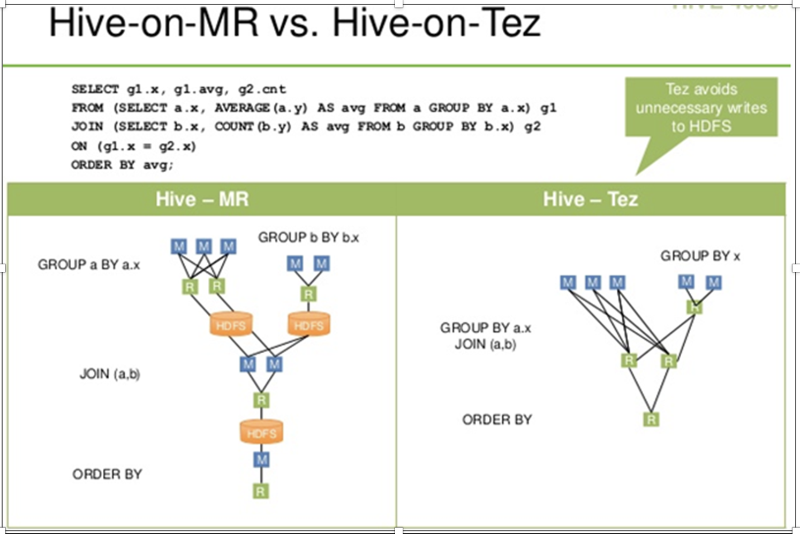
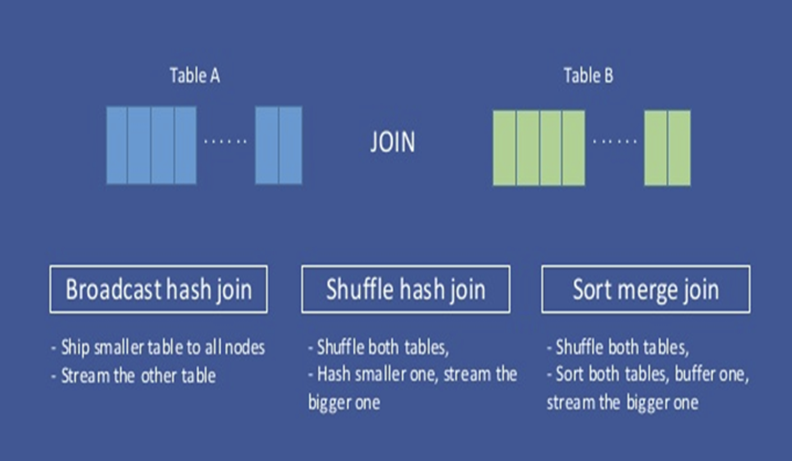
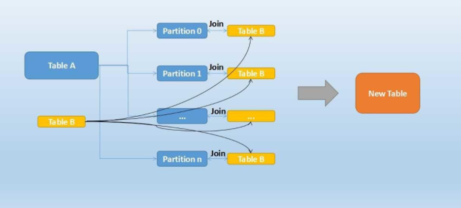
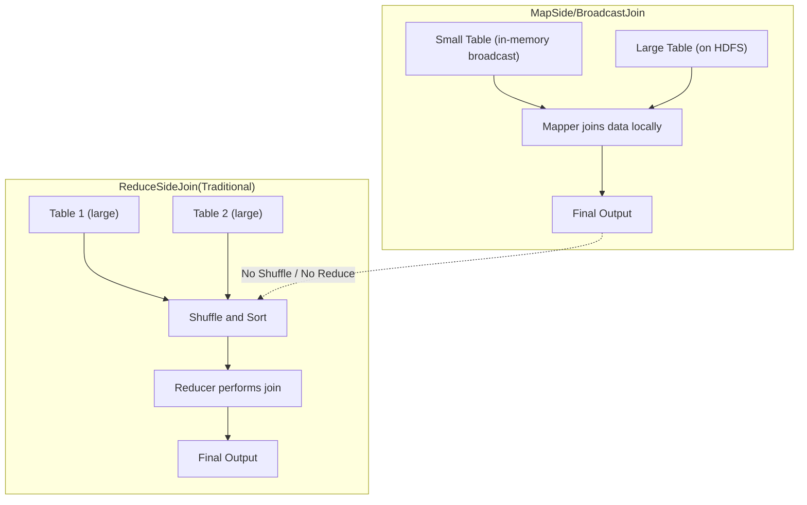
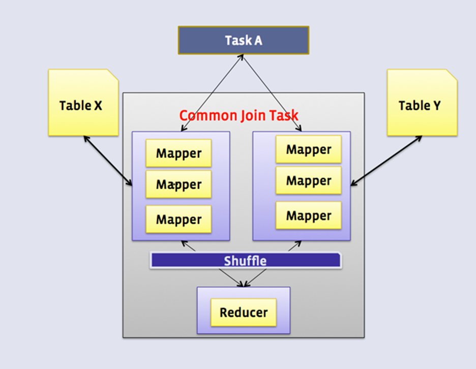
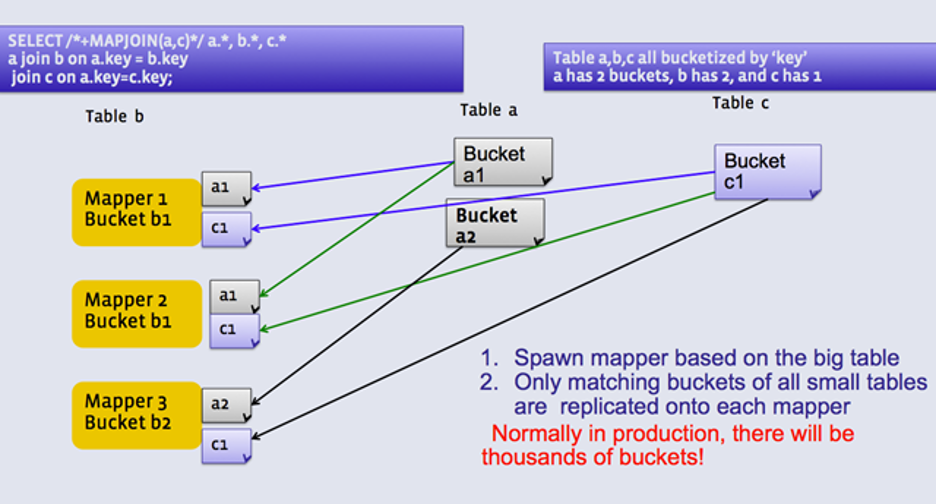

## Q1. Important considerations before performing Hive query performance tuning:

### **1. Table Design & Storage Considerations**

Before tuning, understand how your table is created:

* **Storage format:** Text, ORC, Parquet, Avro, RCFile, etc.
* **Compression:** Is compression enabled (SNAPPY, ZLIB, GZIP)?
* **Partitioning:** Helps prune unnecessary data.
* **Bucketing:** Useful for efficient joins and sampling.

### **2. Gather Table Statistics**

Manual observation and metadata collection help guide optimizations:

* **Data growth rate:** How fast the table size is increasing.
* **Table size & column types:**

  * Example: Large textual columns like chat/call transcripts or narrative feedback (~1.5 GB) might impact performance.
  * **Vectorization:** Avoid reading too many rows at once for heavy textual data (default 1024 rows).
  * **Sqoop fetch size:** Optimize while importing data.
* **Number of columns & rows:**

  * For wide tables, consider **columnar formats** like ORC or Parquet.
* **Cardinality of columns:** Helps decide partitions and buckets for efficient query execution.

### **3. Query Patterns & Clauses**

Understanding your query patterns helps pick optimizations:

* **Inline queries or CTEs**
* **WHERE clauses:** Prefer partition filters for pruning.
* **Joins:** Use bucketing to improve performance on large tables.
* **Aggregations / GROUP BY / HAVING / ORDER BY / LIMIT**
* **Set operations:** UNION / INTERSECT

### **4. Data Writing Considerations**

* **Frequency:** One-time load vs. regular batch loads.
* **Serialization format:** Avro, JSON, Text, ORC, Parquet, RCFile.
* **Compression:** Choose a format that balances read/write speed (e.g., ORC/Parquet with SNAPPY).
* **Reading efficiency:** Columnar formats + compression improve scan times.

### **5. Logging & Monitoring**

* Introduce **logger tables** to capture:

  * Execution time
  * Status of HQL statements
  * Helps identify slow steps in pipelines

### **6. Execution Plan Analysis**

* Use **EXPLAIN** to understand Hive query execution:

  * Join strategy (MapJoin, SortMergeJoin, etc.)
  * Whether **predicate pushdown** or other optimizations are applied

### **7. Environment & Configuration Settings**

Tune both default and query-specific settings:

* **Execution engine:** MR vs. Tez vs. Spark
* **Join types:** Broadcast vs. MapJoin
* **Reducers:** Count, split size, number of reducers
* **CBO (Cost-Based Optimizer)**
* **Vectorization** and parallel execution
* **Heap memory & other JVM settings**

### **Key Takeaways**

* Performance tuning starts **before writing queries**—it’s about understanding **table design, data size, query patterns, and environment settings**.
* Use **columnar formats, compression, partitions, and bucketing** strategically.
* Always validate with **EXPLAIN** and **execution logs** before finalizing optimizations.

---

## Q2. Hive common interview questions:

### **1. Hive MR vs Impala vs Tez**

| Feature          | Hive MR                     | Hive Tez          | Impala                               |
| ---------------- | --------------------------- | ----------------- | ------------------------------------ |
| Execution engine | MapReduce                   | Tez DAG           | Native MPP engine                    |
| Latency          | High                        | Medium            | Low (real-time queries)              |
| Throughput       | Good for batch              | Faster than MR    | High throughput, interactive queries |
| Use case         | Batch processing, large ETL | Faster batch jobs | Interactive analytics, BI dashboards |
| Integration      | Hadoop ecosystem            | Hadoop ecosystem  | Hadoop ecosystem (HDFS)              |

> **Key takeaway:** MR is slow, Tez faster batch, Impala low-latency interactive queries.

### **2. Manually added partition folder not fetched**

* Hive doesn’t automatically recognize new folders.
* **Solutions:**

  * `ALTER TABLE table_name ADD PARTITION (partition_col='value') LOCATION 'path';`
  * **Fool-proof:** `MSCK REPAIR TABLE table_name;`

> **MSCK repair** scans the table location and automatically adds all missing partitions.

### **3. When to choose partitioning & bucketing**

* **Partitioning:**

  * Use when a column has **high cardinality and is often filtered** (`WHERE partition_col=value`).
  * Reduces data scanned → faster queries.
* **Bucketing (sorted buckets):**

  * Use when performing **joins or aggregations** on columns.
  * Improves performance by **reducing shuffle**, enabling **bucketed joins**.
* **Example:**

  ```sql
  CREATE TABLE sales(
      id INT,
      product STRING,
      amount FLOAT
  )
  PARTITIONED BY (year INT)
  CLUSTERED BY (product) INTO 8 BUCKETS
  STORED AS ORC;
  ```

### **4. AVRO vs PARQUET vs ORC**

| Feature          | AVRO                            | Parquet        | ORC                                    |
| ---------------- | ------------------------------- | -------------- | -------------------------------------- |
| Format           | Row-oriented                    | Columnar       | Columnar                               |
| Compression      | Supports                        | Supports       | High compression                       |
| Schema evolution | Easy                            | Moderate       | Moderate                               |
| Performance      | Good for writes                 | Good read/scan | Best for Hive, vectorized read         |
| Use case         | ETL pipelines, schema evolution | Analytics & BI | Hive batch queries, heavy aggregations |

> **Key takeaway:** Use ORC/Parquet for analytics; AVRO when schema evolution is needed.

### **5. Performance improvement in Hive**

* Use **columnar storage** (ORC/Parquet)
* **Partitioning** & **bucketing**
* Enable **vectorization**
* Use **Tez execution engine** instead of MR
* **Predicate pushdown** (filter early)
* Avoid **small files**, use **merge**
* Use **map-side joins** (for small tables)
* Use **CBO (Cost-Based Optimizer)**
* Proper **heap & reducer tuning**

### **6. Table streaming / stream table concept in joins**

* **Idea:** When joining tables, small tables can be **streamed into memory** (hash table)
* **Best practice:**

  * Stream the **smaller table**
  * Larger table is scanned sequentially
* **Hash table:** Used to avoid skew and allow **map-side joins**

> Helps in **avoiding shuffle** and improving join performance.

### **7. Hive Index**

* **Concept:** An index table stores **pointers/addresses** to original data rows for faster lookup.
* **Performance:**

  * Reduces scan of entire table for **filtering operations**.
  * Mostly useful for selective queries.
* **Caveats:**

  * Hive Indexing deprecated from Hive 3.0 onwards.
  * **Alternative:** Materialized views or **ORC/Parquet**, which inherently support **column pruning and indexing**.

---

## Q3. Performance considerations when loading dynamic partitions in Hive, using your example and insights:

### **1. Problem with naive dynamic partition insert**

Example:

```sql
INSERT INTO TABLE abc PARTITION(data_dt)
SELECT * FROM src;
```

* Works for **few partitions**.
* **Side effects when loading many partitions** (e.g., 1 year = 365 days):

  1. **Huge number of small files** → slows down downstream jobs.
  2. **Too many mappers/reducers** → high overhead.
  3. **Out of memory issues** in mappers or reducers (parallel writers).
  4. **Data skew** → some reducers get more data (hotspot), others are underutilized.

### **2. Recommended approach**

#### **Step 1: Control the number of mappers/reducers**

```sql
SET mapred.map.tasks=37;
SET mapred.reduce.tasks=37;
```

* Ensures **controlled parallelism**, avoids excessive small files and OOM.

#### **Step 2: Distribute data by partition key**

```sql
INSERT INTO TABLE abc PARTITION(data_dt)
SELECT * 
FROM src
DISTRIBUTE BY data_dt;
```

* `DISTRIBUTE BY data_dt` ensures:

  * **Reducer writes data for specific partition(s)**.
  * Mitigates **skewness** by evenly distributing workload.
  * Equivalent to **hash(data_dt) % num_reducers**.

> Example: If each date has 10 MB, 37 reducers → ~10 dates per reducer.

#### **Step 3: Handle larger datasets (e.g., 10 years)**

* Instead of creating 1 reducer per partition, you can use **fewer reducers**:

  * One reducer may write multiple partitions.
* This reduces **overhead from too many small files**.

### **3. Common challenges and solutions**

| Challenge                  | Solution                                                           |
| -------------------------- | ------------------------------------------------------------------ |
| Huge number of small files | Use controlled reducers + ORC/Parquet for compression              |
| OOM in mappers/reducers    | Reduce parallelism, use columnar format, increase memory if needed |
| Data skew / hot partition  | Use `DISTRIBUTE BY partition_key` to evenly spread partitions      |
| Slow upstream jobs         | Avoid creating hundreds of tiny files per partition                |

### **4. Key Recommendations**

1. Always use **`DISTRIBUTE BY partition_key`** in dynamic partition inserts.
2. Use **ORC/Parquet** to reduce file size and memory overhead.
3. Tune **number of mappers and reducers** based on data size.
4. For very large datasets (years of partitions), **one reducer can write multiple partitions** to avoid excessive small files.
5. Monitor for **skew** and **OOM issues**, adjust reducer count accordingly.
6. What changes when you use DISTRIBUTE BY data_dt

  ```sql 
  INSERT INTO TABLE abc PARTITION(data_dt)
  SELECT * FROM src
  DISTRIBUTE BY data_dt;
  ```
  * Still creates 365 partitions, but:
    * Distribution is done on reduce side → each reducer is responsible for writing data for a subset of partitions.
    * Hive ensures that all rows for the same data_dt go to the same reducer.
  * This prevents multiple reducers from writing to the same partition simultaneously.
    So yes, number of partitions = number of unique data_dt values,
    but number of output files per partition and job overhead are drastically reduced.

| Problem              | Without `DISTRIBUTE BY`                    | With `DISTRIBUTE BY data_dt`              |
| -------------------- | ------------------------------------------ | ----------------------------------------- |
| Number of partitions | Same (depends on distinct data_dt)         | Same                                      |
| Small file count     | Very high (multiple writers per partition) | Controlled (1 reducer writes 1 partition) |
| Data skew            | Possible (uneven load per reducer)         | Reduced (hash-based distribute)           |
| OOM errors           | More likely                                | Less likely (controlled reducer count)    |


✅ **Summary:**
Dynamic partition inserts need **controlled parallelism + smart distribution** to avoid small files, OOM, and skew. `DISTRIBUTE BY partition_key` is the key technique for evenly splitting work across reducers.

---

## Q4.✅ Can we use WITH (CTE) in Hive?

Yes — supported from **Hive 0.13+**.
CTE = **temporary result set** (like a temp table) available only for that query.

### **Why use it?**

* Reuse same query multiple times (runs once).
* Cleaner, modular queries.
* Helpful when migrating from **Teradata/Oracle** temp tables.

### **Example: Customers who played both Games & Puzzles + only Games**

```sql
WITH 
T1 AS (SELECT custno, category, product FROM txnrecords WHERE category='Games'),
T2 AS (SELECT custno, category, product FROM txnrecords WHERE category='Puzzles')
SELECT t1.*
FROM T1 
JOIN T2 
  ON T1.custno=T2.custno AND T1.product=T2.product
UNION
SELECT * FROM T1;
```

### **CTE vs Inline Subquery**

| Feature     | CTE            | Inline View        |
| ----------- | -------------- | ------------------ |
| Reuse       | ✅ Once, reused | ❌ Repeated scans   |
| Readability | ✅ Clean        | ❌ Nested           |
| Performance | ✅ Better       | ❌ Costly for reuse |

🟩 **Tip:** Use CTE when the same query logic repeats — it’s like a lightweight temp table.

---

## Q5. Hive table rename and data movement scenarios👇

### **1. External Table Rename**

* Command:

  ```sql
  ALTER TABLE old_name RENAME TO new_name;
  ```
* ✅ Table renamed
* ❌ Data **does NOT move** — still stays in old HDFS location

**If you also want to move the data:**

```bash
hadoop fs -mv -R /path/to/old_dir /path/to/new_dir
```

Then update table location if needed:

```sql
ALTER TABLE new_name SET LOCATION 'hdfs:/path/to/new_dir';
```

### **2. Managed Table Rename**

* Command:

  ```sql
  ALTER TABLE old_name RENAME TO new_name;
  ```
* ✅ Both **table metadata** and **data folder** in HDFS are renamed automatically.


### **3. Alternative (If ALTER is slow for large/partitioned tables)**

Use **EXPORT and IMPORT**:

```sql
EXPORT TABLE old_tbl TO 'hdfs:/tmp/export_path/';
IMPORT TABLE new_tbl FROM 'hdfs:/tmp/export_path/';
```

➡ Creates new table with data moved, without manually recreating schema.


### **4. Create New Table Pointing to Old Data (Manual Way)**

```sql
SHOW CREATE TABLE old_tbl;
CREATE EXTERNAL TABLE new_tbl (...) LOCATION 'hdfs:/path/to/old_data/';
MSCK REPAIR TABLE new_tbl;
DROP TABLE old_tbl;
```

### **5. Copy Data to a New Table (Costly Approach)**

```sql
CREATE TABLE new_tbl AS SELECT * FROM old_tbl;
DROP TABLE old_tbl;
```

* Creates a **new physical copy** of data (uses MapReduce).


### **6. Create Empty Table with Same Structure**

```sql
CREATE TABLE new_tbl LIKE old_tbl;
-- or
CREATE TABLE new_tbl AS SELECT * FROM old_tbl WHERE 1=2;
```

* Structure copied, **no data copied**.


✅ **Summary Table**

| Scenario                | Data Moved? | Recommended Action                               |
| ----------------------- | ----------- | ------------------------------------------------ |
| Rename External Table   | ❌ No        | Use `hadoop fs -mv` + `ALTER TABLE SET LOCATION` |
| Rename Managed Table    | ✅ Yes       | Simple `ALTER TABLE RENAME TO`                   |
| Slow ALTER on big table | ✅ Yes       | Use `EXPORT` / `IMPORT`                          |
| Copy data               | ✅ Yes       | `CTAS` (costly)                                  |
| Copy only schema        | ❌ No        | `LIKE` or `WHERE 1=2`                            |

---

## Q6. Hive Performance Tuning – Quick Summary

### 🔹 Query Optimization Techniques

* **Order By, Sort By, Distribute By, Cluster By** — control reducer and data distribution.
* **Compression** → `set mapred.output.compression=true;`
* **Indexing, Partitioning, Bucketing** — reduce scan size.
* **Optimized Joins** → `/* +streamtable(table_name) */`
* **Parallel Execution** → `set hive.exec.parallel=true;`
* **Strict Mode** → prevents full table scans, unsafe queries.
  `set hive.mapred.mode=strict;`
* **Set Reducers** → `set mapred.reduce.tasks=<num>;`
* **Speculative Execution** →
  `set mapred.map.tasks.speculative.execution=true;`
  `set mapred.reduce.tasks.speculative.execution=true;`

### 🔹 Vectorization

* Processes batches of rows (instead of row-by-row) → speeds up query execution.

```sql
set hive.vectorized.execution.enabled=true;
set hive.vectorized.execution.reduce.enabled=true;
```

### 🔹 CBO (Cost-Based Optimizer)

* Powered by **Apache Calcite** — generates the most efficient query plan.
* Performs:

  * **JOIN reordering**
  * **Query rewrite & predicate pushdown**
  * **JOIN elimination**

#### Enable CBO:

```sql
set hive.cbo.enable=true;
set hive.compute.query.using.stats=true;
set hive.stats.fetch.column.stats=true;
set hive.stats.fetch.partition.stats=true;
set hive.stats.autogather=true;
```

#### Gather Statistics:

```sql
analyze table tablename compute statistics;
analyze table tablename compute statistics for columns sender;
analyze table tablename compute statistics for partition;
```

✅ **Result:**
Better join order, fewer reducers, and reduced query runtime.

---

Perfect — here’s a **short, interview-ready version** of your *Vectorization* explanation 👇

---

## Q7. Vectorization in Hive

**Definition:**
Vectorization improves query performance by processing a *batch of rows (default 1024)* at once instead of row-by-row.

**How it works:**

* Each column is stored as a **vector (array)** in memory.
* Operations like **scan, filter, aggregation, joins** are applied on these vectors → fewer function calls and CPU instructions.
* Reduces overhead from repeated object creation and metadata interpretation.

**When to Use:**

* When queries select **fewer and small-sized columns** (e.g. `VARCHAR(100)`, `DATE`, `FLOAT`).
* Not ideal for queries involving **large complex types**.

**Settings:**

```sql
set hive.vectorized.execution.enabled = true;
set hive.vectorized.execution.map.enabled = true;
set hive.vectorized.execution.reduce.enabled = true;
```

✅ **Benefit:** Significant performance gain (2x–10x) for analytic workloads.

---

## Q8. How to get better performance in Hive or different serialization and compression techniques used in Hive?

**1️⃣ Use Efficient File Formats**

* Prefer **ORC** or **Parquet** over Text/CSV — they are **columnar formats** that support:

  * Compression
  * Predicate pushdown
  * Lazy loading
  * Built-in indexing

**2️⃣ Use Compression Techniques**

* Reduces storage size and improves I/O performance.
* Common combinations:

  * `ORC + Snappy` → Best balance (fast read/write) ✅
  * `ORC + Zlib` → Better compression ratio (slower)
  * `Parquet + Snappy` → Widely used in Spark + Hive setups

**3️⃣ Example — High-Performance Table Creation**

```sql
DROP TABLE customers2;

CREATE EXTERNAL TABLE customers2 (
  userid STRING,
  name   STRING
)
ROW FORMAT DELIMITED
FIELDS TERMINATED BY ','
STORED AS ORC
LOCATION '/user/hduser/custdata2'
TBLPROPERTIES ("orc.compress" = "SNAPPY");
```

**4️⃣ Additional Tips**

* Enable **CBO** and **Vectorization** for optimized query execution.
* Gather **table statistics** using:

  ```sql
  ANALYZE TABLE customers2 COMPUTE STATISTICS;
  ```
* Use **Partitioning** and **Bucketing** for large datasets.

✅ **Result:** Up to **5x–10x faster query performance** compared to Text/CSV tables.

---

Here’s a **clear and short version** for your notes or interview use 👇

---

## Q9. 🧠EXPLAIN / Execution Plan in Hive

**Purpose:**
The `EXPLAIN` command in Hive displays **how a query will be executed** — showing each stage (parse → optimize → execute) as an **Abstract Syntax Tree (AST)** and **logical/physical plan**.

**Why it’s useful:**

* Helps understand **query flow** (scans, joins, filters, aggregations).
* Identifies **bottlenecks** or unnecessary MapReduce/Tez stages.
* Guides performance tuning (e.g., join order, partition pruning).

**Command Example:**

```sql
EXPLAIN SELECT a.id, b.name
FROM customers a
JOIN orders b ON a.id = b.custid;
```

**Output Includes:**

* **AST (Abstract Syntax Tree)** – Parsed query structure.
* **Logical Plan** – Optimized relational operations.
* **Stage Plan** – Map/Reduce or Tez DAG stages.
* **Operator Tree** – Sequence of operators used (Filter, MapJoin, ReduceSink, etc.).

✅ **Tip:**
Use `EXPLAIN EXTENDED` or `EXPLAIN FORMATTED` for detailed plans and stats.


---

## Q10. Hive File Format Comparison

| Feature / Aspect                | **TextFile**     | **RCFile**                   | **Avro**                                | **ORC (Optimized Row Columnar)** | **Parquet**                                      |
| ------------------------------- | ---------------- | ---------------------------- | --------------------------------------- | -------------------------------- | ------------------------------------------------ |
| **Storage Type**                | Row-based        | Columnar (Row-Column hybrid) | Row-based (binary serialization)        | Columnar                         | Columnar                                         |
| **Compression Support**         | Gzip, Bzip2      | Gzip                         | Snappy, Deflate, Bzip2                  | Zlib, Snappy, LZO, None          | Snappy, Gzip, LZO                                |
| **Compression Efficiency**      | ❌ Low            | ⚪ Moderate                   | ⚪ Moderate                              | ✅ High                           | ✅ High                                           |
| **Read Performance**            | ❌ Slow           | ⚪ Better                     | ⚪ Moderate                              | ✅ Excellent                      | ✅ Excellent                                      |
| **Write Performance**           | ✅ Fast           | ⚪ Medium                     | ✅ Fast                                  | ⚪ Slightly Slower                | ⚪ Slightly Slower                                |
| **Schema Evolution Support**    | ❌ No             | ❌ No                         | ✅ Yes                                   | ⚪ Partial                        | ✅ Yes                                            |
| **Predicate Pushdown**          | ❌ No             | ⚪ Limited                    | ⚪ Limited                               | ✅ Yes                            | ✅ Yes                                            |
| **Vectorization (Hive)**        | ❌ No             | ❌ No                         | ❌ No                                    | ✅ Yes                            | ❌ (Supported in Spark only)                      |
| **ACID Transaction Support**    | ❌ No             | ❌ No                         | ⚪ Used for ACID base data serialization | ✅ Yes (Hive ≤ v3.x)              | ❌ No                                             |
| **Complex / Nested Data Types** | ❌ No             | ⚪ Limited                    | ✅ Yes                                   | ✅ Yes                            | ⚪ Partial (Limited nested struct support)        |
| **Indexing / Stride Index**     | ❌ No             | ❌ No                         | ❌ No                                    | ✅ Yes                            | ⚪ No explicit index                              |
| **Splittable**                  | ✅ Yes            | ✅ Yes                        | ✅ Yes                                   | ✅ Yes                            | ✅ Yes                                            |
| **File Size (vs Text)**         | 100%             | ~85%                         | ~70%                                    | ~25%                             | ~35%                                             |
| **Best Use Case**               | Simple text data | Transitional columnar format | Schema evolution, interoperability      | High-performance Hive analytics  | Cross-platform analytics (Spark, Presto, Athena) |
| **Typical Compression Example** | Text + Gzip      | RCFile + Gzip                | Avro + Snappy                           | ORC + Snappy                     | Parquet + Snappy                                 |


### ✅ Quick Insights

* **ORC → Best for Hive** → Vectorization, ACID, predicate pushdown, high compression.
* **Parquet → Best for Multi-engine Analytics** → Efficient for Spark, BigQuery, Athena.
* **Avro → Best for Data Exchange** → Great schema evolution + good for ingestion pipelines.
* **RCFile → Legacy format**, replaced by ORC/Parquet.
* **TextFile → Simple but inefficient**, only for raw or small datasets.

---

## Q11. Hive Engine -> TEZ


### **1. TEZ Engine**

* **Definition:** Tez is an **advanced execution engine** for Hadoop, designed to improve performance over traditional MapReduce for Hive queries.
* **Purpose:** It optimizes the execution of complex DAGs (Directed Acyclic Graphs) for faster query processing.
* **How to enable:**

```sql
set hive.execution.engine=tez;
```

* **Advantage:** Significantly faster than MapReduce for iterative and multi-stage queries.

### **2. DAG (Directed Acyclic Graph)**

* **Definition:** A DAG is a graph structure that **represents a sequence of operations** where each node is a task, and edges show dependencies.
* **In Tez:**

  * Hive queries are converted into a DAG of tasks.
  * Tez executes tasks in parallel wherever possible, respecting dependencies.
* **Benefit:** Optimizes execution and reduces redundant reads/writes.

### **3. Container Reusability**

* **Definition:** In Tez, containers (YARN-managed resources) can be **reused for multiple tasks**, instead of launching a new container each time.
* **Benefit:**

  * Reduces overhead of container setup.
  * Improves performance for small tasks or iterative jobs.

  
### **4. Dynamic Graphs**

* **Definition:** Tez allows the DAG to **change dynamically during runtime** based on input size or intermediate results.
* **Advantage:**

  * Adapts execution for better parallelism.
  * Avoids unnecessary resource allocation.

  
### **5. Enabling Tez in Hive**

```sql
set hive.execution.engine=tez;
```

* Switches the Hive execution engine from **MapReduce** (default) to **Tez**.
* After setting, all subsequent Hive queries will use the Tez engine until the session ends or engine is changed.

✅ **Summary:**
Using **Tez** in Hive means faster execution, better resource utilization, and optimized query DAGs with container reusability and dynamic execution paths.


| Feature | Hive-on-MR (MapReduce) | Hive-on-Tez |
| :--- | :--- | :--- |
| **Execution Model** | Sequential chain of multiple **MapReduce jobs**. | Single, integrated **Directed Acyclic Graph (DAG)**. |
| **Intermediate I/O** | Mandatory **writes to HDFS** between every MapReduce job (High Disk I/O). | **Avoids unnecessary writes to HDFS**; data transfer is often in-memory (Low Disk I/O). |
| **Data Flow** | **Staging/Batch-oriented:** Output of one job must be fully written before the next job starts. | **Pipelined:** Output of one stage is fed directly as input to the next stage. |
| **Latency** | **High latency** due to sequential execution and disk I/O overhead. | **Low latency** due to streamlined execution and reduced I/O. |
| **Efficiency** | Lower efficiency, especially for complex queries. | **Much higher efficiency** and faster query execution. |
| **Example in Diagram** | Separate steps for `GROUP BY a.x`, writing to HDFS, `GROUP BY b.x`, writing to HDFS, `JOIN (a,b)`, writing to HDFS, and `ORDER BY`. | Integrated steps: `GROUP BY a.x` and `GROUP BY b.x` feed directly into `JOIN (a,b)` and then `ORDER BY` without intermediate HDFS writes. |



---

## Q12. When to use which engine in a Hadoop/Hive ecosystem:

| Engine                                   | Typical Use Case                                            | Notes                                                                                                                                                                                 |
| ---------------------------------------- | ----------------------------------------------------------- | ------------------------------------------------------------------------------------------------------------------------------------------------------------------------------------- |
| **MapReduce (MR)**                       | Batch ETL/ELT loads where speed isn’t critical              | Works well for large-scale batch processing but high latency; not ideal if SLA/ETA is strict.                                                                                         |
| **Tez / Spark**                          | In-memory processing for faster batch jobs                  | Optimized for high throughput and low latency; suitable when you need faster SLA/ETA compared with MR. Spark is especially good for complex transformations and iterative processing. |
| **Impala / Presto / Athena / Hive LLAP** | Ad-hoc or real-time queries by end-users or reporting teams | Optimized for interactive queries with low latency; ideal for BI dashboards, analytics, or dynamic queries. LLAP improves Hive query performance by caching and persistent daemons.   |

**Summary:**

* **MR** → slow batch ETL/ELT
* **Tez/Spark** → faster batch, in-memory transformations
* **Impala/Presto/Athena/LLAP** → interactive, ad-hoc, low-latency queries

---


## Q13. Order by Behaviors:

| Clause                                            | Reducer Behavior                                | Sorted? | Comment                                       |
| ------------------------------------------------- | ----------------------------------------------- | ------- | --------------------------------------------- |
| `SORT BY userid, accesstime`                      | Each reducer sorts its data, overlapping ranges | Partial | Multiple reducers, not globally sorted        |
| `DISTRIBUTE BY userid`                            | Rows distributed by userid, no sorting          | No      | Avoid if sorting needed                       |
| `DISTRIBUTE BY userid SORT BY userid, accesstime` | Distributed by userid, sorted within reducers   | Yes     | Good for multi-reducer sorting                |
| `CLUSTER BY userid, accesstime`                   | Distributed by userid, sorted within reducer    | Yes     | Best choice for distributed sorting and order |
| `ORDER BY userid, accesstime`                     | Single reducer, globally sorted                 | Yes     | Only for small datasets                       |

---

## Q14. Concise summary of common Hive/Tez settings** with key guidelines:


### **1. Hive Map Join Settings**

| Property                                        | Purpose / Guideline                                                 | Default (Ambari) |
| ----------------------------------------------- | ------------------------------------------------------------------- | ---------------- |
| `hive.auto.convert.join`                        | Enable automatic map joins for small tables                         | Auto-tuned       |
| `hive.auto.convert.join.noconditionaltask`      | Allow map join without conditions                                   | Auto-tuned       |
| `hive.auto.convert.join.noconditionaltask.size` | Max size of small table to load in memory; ~1/3 of `-Xmx` if manual | Auto-tuned       |

> **Note:** Map joins load smaller tables into memory, skipping reducers → much faster for small table joins.


### **2. Tez Container Settings**

| Property                  | Guideline                            | Default (Ambari) |
| ------------------------- | ------------------------------------ | ---------------- |
| `hive.tez.container.size` | Production: 4–8 GB; Small VM: 1–2 GB | Auto-tuned       |
| `hive.tez.java.opts`      | JVM heap: 80–90% of container size   | Auto-tuned       |


### **3. Tez Grouping Settings**

| Property                   | Guideline                                                    | Default           |
| -------------------------- | ------------------------------------------------------------ | ----------------- |
| `tez.grouping.min.size`    | Lower → better latency; Higher → more throughput             | 16 MB (16777216)  |
| `tez.grouping.max.size`    | Lower → better latency; Higher → more throughput             | 1 GB (1073741824) |
| `tez.grouping.split-waves` | Higher → launch more containers; Lower → better multitenancy | 1.7               |

### **4. YARN Scheduler**

| Property                               | Guideline                                             | Default    |
| -------------------------------------- | ----------------------------------------------------- | ---------- |
| `yarn.scheduler.minimum-allocation-mb` | Minimum memory per container; 1 GB usually sufficient | Auto-tuned |


**💡 Quick Tip:**

* Map join → faster when joining small tables.
* Tez container & grouping → tune for latency vs throughput tradeoff.
* `hive.tez.java.opts` should not exceed container heap.

---

## Q15. Performance tuning in Hive with different join options:



Here's a simple explanation of each method with an example:

---

## The Concept: Joining Tables

Imagine you have two datasets:

* **Table A:** A list of **Customer IDs** and their **Names** (e.g., `(101, 'Alice')`, `(102, 'Bob')`).
* **Table B:** A list of **Customer IDs** and their **Order Totals** (e.g., `(101, $50)`, `(103, $20)`).

A JOIN combines these two tables based on the common **Customer ID** to get a single result, for example: `(101, 'Alice', $50)`.

## 1. Broadcast Hash Join / Map Side Join

This method is the fastest when one table is **significantly smaller** than the other and can fit entirely into the memory of every processing node.

* **How it Works:** The system identifies the **smaller table** (let's say Table A) and **broadcasts** (sends a complete copy of) it to *every* node that holds a part of the larger table (Table B). The nodes then perform a simple, local **hash join** without needing to move the larger table's data.
* **Key Advantage:** Avoids the expensive network shuffling of the large table.
* **Example:** If Table A (Names) has 10,000 rows, and Table B (Orders) has 1 billion rows, the system will broadcast the small Table A to all nodes. Each node then joins its small chunk of the 1 billion orders locally with the complete list of names.

## 2. Shuffle Hash Join / Reduce Side Join

This method is a good choice when **neither table is small enough** to be broadcast, but one is still **moderably smaller** than the other.

* **How it Works:**
    1.  **Shuffle Both:** Both tables (A and B) are partitioned (shuffled) across the network using the **join key** (e.g., Customer ID). This ensures that all rows with the *same* join key end up on the *same* processing node.
    2.  **Hash the Smaller:** On each node, the **smaller** of the two local partitions is used to build an in-memory **hash map**.
    3.  **Stream the Bigger:** The larger partition is then **streamed** (read row by row) against the hash map to find matches.
* **Key Advantage:** It's generally faster than a Sort Merge Join if the partitions are small enough to be hashed efficiently.
* **Example:** Table A and Table B are both large, but Table A is $20\%$ smaller. After shuffling both tables by Customer ID, each node builds a hash map from its smaller Table A chunk and uses that to look up matches in its larger Table B chunk.

## 3. Sort Merge Join

This is the default and most **robust** join strategy, best used when **both tables are very large** and similarly sized, or when the join key has a high number of distinct values.

* **How it Works:**
    1.  **Shuffle Both:** Both tables (A and B) are shuffled across the network based on the join key, just like in Shuffle Hash Join.
    2.  **Sort Both:** On each node, the partitions of both tables are **sorted** based on the join key.
    3.  **Merge:** The sorted partitions are then **merged** by iterating through both lists simultaneously. Since both are sorted, the system can simply walk down both lists, finding matches efficiently.
* **Key Advantage:** It's very memory efficient because it only needs to keep a small buffer of rows in memory, making it reliable for extremely large datasets that would overwhelm the memory required for hashing.
* **Example:** Table A (Names) and Table B (Orders) are both 1 billion rows. After shuffling, each node sorts its local chunk of A and its local chunk of B. It then merges the two sorted lists, like merging two halves of a phone book, to find the matching entries.

---

## Q16. Map Side Join (Broadcast Join) - cost efficient join

### 🧠 Hive Optimization — Map Side Join (Broadcast Join)



### 🔍 **Overview**

**Map Side Join** (also known as **Broadcast Join**) is a **cost-efficient join strategy** in Hive.
It brings the **smaller tables** to the **node where the large table resides** and performs the **join operation at the mapper stage itself**, avoiding shuffle and reduce phases.

### ⚙️ **How It Works**

* The **smaller table** is **broadcasted** to all mapper nodes.
* Each mapper loads this small table **into memory** and performs the join locally with the partitioned data of the **larger table**.
* Since there is **no data shuffling**, the query runs much faster.

### ✅ **Key Benefits**

* Eliminates the **shuffle** and **reduce** stages.
* Greatly improves **performance** when joining a small table with a large one.
* Ideal for **star schema joins** (dimension–fact model).

### 💡 **Example Use Case**

Suppose we have:

* `bigtable` — 1.5 billion+ transaction records
* `smalltable` — 100 records (e.g., a lookup or master table)

### SQL Example:

```sql
SELECT bigtable.a, bigtable.b, smalltable.c
FROM bigtable
JOIN smalltable
ON bigtable.a = smalltable.a;
```

### 🧩 **Hive Behavior**

By default, Hive **streams the right-most table** (`smalltable`) and **buffers other tables** (`bigtable`) before performing a map-side or reduce-side join.

⚠️ **Problem:**
If the large table (`bigtable`) is buffered, Hive may run out of memory — causing a `Java Heap Space` exception.

### ⚙️ **Hive Parameters for Map Side Join**

Enable map-side join optimizations with:

```sql
SET hive.auto.convert.join = true;
SET hive.auto.convert.join.noconditionaltask = true;
SET hive.auto.convert.join.noconditionaltask.size = 10000000; -- 10 MB threshold
```

This allows Hive to automatically convert eligible joins into **map joins** when the smaller table fits into the defined size threshold.

### 🔍 **Example Query with AUTO MAP JOIN**

```sql
EXPLAIN
SELECT c.*, cb.*
FROM customer c
LEFT OUTER JOIN customerbkp cb
ON c.id = cb.id
WHERE cb.state = 'NY';
```

👉 Here, `customerbkp` (the smaller table) is streamed to the mappers where `customer` (the large table) data resides.


### ⚖️ **Advantages**

✅ **Speed:** Avoids expensive shuffle and reduce operations.  
✅ **Efficiency:** Useful for small-to-large table joins (dimension ↔ fact).  
✅ **Automatic Optimization:** Hive can convert regular joins to map joins automatically.  

### ⚠️ **Limitations (Cons)**

❌ Requires **at least one small table** (must fit into mapper memory).  
❌ Does **not support** `RIGHT OUTER JOIN` or `FULL OUTER JOIN`.  
❌ If small table size exceeds threshold, Hive reverts to reduce-side join.  

### 🧭 **Tips & Tuning**

#### **1. Auto Convert Joins**

Let Hive automatically decide when to use map join:

```sql
SET hive.auto.convert.join = true;
SET hive.auto.convert.join.noconditionaltask = true;
SET hive.auto.convert.join.noconditionaltask.size = 10000000;
```

#### **2. Force Map Join with Hint**

When you want to **explicitly force** a map join:

```sql
SET hive.ignore.mapjoin.hint = false;

SELECT /*+ MAPJOIN(cb) */
  c.*, cb.*
FROM customer c
LEFT OUTER JOIN customerbkp cb
ON c.id = cb.id
WHERE cb.state = 'NY';
```

🧩 **Explanation:**
The hint `MAPJOIN(cb)` tells Hive to **load `cb` into memory** and perform the join entirely in the mapper phase.

### 🧮 **Performance Comparison**

| Join Type        | Data Shuffle | Reduce Stage | Use Case           | Performance |
| ---------------- | ------------ | ------------ | ------------------ | ----------- |
| Reduce Side Join | ✅ Yes        | ✅ Yes        | Large-Large tables | Slow        |
| Map Side Join    | ❌ No         | ❌ No         | Small-Large tables | ⚡ Fast      |


### 🧰 **Summary**

| Parameter                                       | Description                                         |
| ----------------------------------------------- | --------------------------------------------------- |
| `hive.auto.convert.join`                        | Enables automatic conversion to map-side join       |
| `hive.auto.convert.join.noconditionaltask`      | Enables non-conditional task for small tables       |
| `hive.auto.convert.join.noconditionaltask.size` | Threshold (in bytes) for considering table as small |
| `hive.ignore.mapjoin.hint`                      | When false, allows use of `MAPJOIN` hint manually   |




---

## Q17. Shuffle Hash Join (ReduceSide Join)

The term **"ReduceSide Join"** is the older name for what is now commonly referred to as a **Shuffle Hash Join** in Hive, or simply the **Common Join**.

The Shuffle Hash Join is the **default and most generic join strategy** in Hive. It is executed across three major phases: the Map phase, the Shuffle phase, and the Reduce phase, which is where the actual join operation occurs.

### 1\. The Execution Flow

The Shuffle Hash Join requires the data from both tables to be **sorted and exchanged (shuffled)** across the network so that rows with the same join key end up on the same reducer.

| Stage | Process | Action |
| :--- | :--- | :--- |
| **Mapper** | Reads the data tables. | Outputs the join key and the corresponding value/row from each table into an intermediate file (spill). Each table's rows are tagged to distinguish them. |
| **Shuffle/Sort** | The core data exchange mechanism. | The intermediate key-value pairs are **sorted** and then **transferred (shuffled)** across the network to the correct reducer based on the hash of the **join key**. All matching keys from both tables go to the same reducer. |
| **Reducer** | Performs the actual join. | The reducer receives all the sorted rows for a specific join key, reads them, and performs the join logic (e.g., inner, left, full outer) to produce the final joined row. |

### 2\. Hive Configuration Example

You can force Hive to use this classic join strategy by explicitly disabling the automatic use of more optimized joins:

```sql
SET hive.auto.convert.join=false;         -- Disables MapSide Join (and common join optimizations)
SET hive.auto.convert.sortmerge.join=false; -- Disables Sort-Merge Bucket Join

EXPLAIN select b1.* from buckettxnrecsbycatsorted b1, buckettxnrecsbycatsorted b2 where b1.txnno=b2.txnno;
```

### Use Cases and Drawbacks

#### Use Case

  * **Handling Large Tables:** This join works for **any table size**, making it the reliable choice when both tables involved in the join are too **large** to fit into memory or for when an optimized join is not possible.
  * **Complex Join Types:** It is the only join type that reliably supports **`FULL OUTER JOIN`**, as it ensures all records from both sides, even those with no matches, are processed.

#### Cons

  * **Most Resource Intensive:** The Shuffle Hash Join is the slowest and most resource-intensive method. The necessary **shuffle** (network transfer, serialization/deserialization, and sorting) is an **expensive I/O operation** that consumes significant cluster resources.

---

## Q18. Sort Merge Bucket (SMB) Map Join or Bucket Join

**How:**
Join is done in Mapper only. The corresponding buckets are joined with each other at the mapper.



```sql
set hive.enforce.bucketing = true ;
set hive.enforce.sorting = true;

CREATE TABLE `txns_bucketed`(
  `txn_id` string, 
  `txn_date` string, 
  `cust_id` string, 
  `amount` double, 
  `category` string, 
  `subcategory` string, 
  `city` string, 
  `state` string, 
  `payment_type` string
  )
clustered by (txn_id) sorted by (txn_id) INTO 10 buckets
row format delimited 
fields terminated by ','
stored as textfile
;

Insert into table txns_bucketed 
select txn_id, txn_date, cust_id, amount, category, subcategory, city, state, payment_type
from txns;

set hive.auto.convert.sortmerge.join = true;
set hive.optimize.bucketmapjoin = true;
set hive.optimize.bucketmapjoin.sortedmerge = true;

explain
select /*+ MAPJOIN(b2) */ b1.* 
from txns_bucketed b1, txns_bucketed b2 
where b1.txn_id = b2.txn_id;

explain
select b1.* 
from txns_bucketed b1, txns_bucketed b2 
where b1.txn_id = b2.txn_id;

/*
STAGE DEPENDENCIES:
  Stage-1 is a root stage
  Stage-0 depends on stages: Stage-1

STAGE PLANS:
  Stage: Stage-1
    Map Reduce
      Map Operator Tree:
          TableScan
            alias: b1
            Statistics: Num rows: 14385600 Data size: 1247559450 Basic stats: COMPLETE Column stats: NONE
            Filter Operator
              predicate: txn_id is not null (type: boolean)
              Statistics: Num rows: 14385600 Data size: 1247559450 Basic stats: COMPLETE Column stats: NONE
              Select Operator
                expressions: txn_id (type: string), txn_date (type: string), cust_id (type: string), amount (type: double), category (type: string), subcategory (type: string), city (type: string), state (type: string), payment_type (type: string)
                outputColumnNames: _col0, _col1, _col2, _col3, _col4, _col5, _col6, _col7, _col8
                Statistics: Num rows: 14385600 Data size: 1247559450 Basic stats: COMPLETE Column stats: NONE
                Sorted Merge Bucket Map Join Operator
                  condition map:
                       Inner Join 0 to 1
                  keys:
                    0 _col0 (type: string)
                    1 _col0 (type: string)
                  outputColumnNames: _col0, _col1, _col2, _col3, _col4, _col5, _col6, _col7, _col8
                  File Output Operator
                    compressed: false
                    table:
                        input format: org.apache.hadoop.mapred.SequenceFileInputFormat
                        output format: org.apache.hadoop.hive.ql.io.HiveSequenceFileOutputFormat
                        serde: org.apache.hadoop.hive.serde2.lazy.LazySimpleSerDe

  Stage: Stage-0
    Fetch Operator
      limit: -1
      Processor Tree:
        ListSink

*/
```

**Use Case:**
When all tables are:
Here’s the same explanation in a **clear, normal (non-markdown)** format — you can directly use this for your notes:

* Large
* Bucketed using the join columns
* Sorted using the join columns
* All tables have the same number or multiples of buckets

**Cons:**

* Tables need to be bucketed in the same way as join columns, so it cannot be used for other types of SQLs.
* Partitioned tables might slow down performance.

---

## Q19. Skewness and the Bottleneck Problem :

**Skewness** is the property of data where the values in a column are not evenly distributed, causing a small number of keys to account for a vast majority of the rows.

### The Problem in ReduceSide Join

1.  **Fact Table Skew:** In your example, $99$ million out of $100$ million records in the **FACT** table share the same join key (`prod_cd = 250`).
2.  **Shuffle Mechanism:** In a ReduceSide Join (Shuffle Hash Join), the join key is hashed to determine which reducer receives the data.
3.  **Bottleneck:** All $99$ million rows with `prod_cd = 250` will be shuffled to the **same single reducer**.
4.  **Observation:** The job quickly completes the processing of the $1$ million non-skewed records (distributed across many reducers) but gets stalled as the single, overloaded reducer attempts to process the $99$ million skewed records. This is the phenomenon of a job appearing to be stuck at **"Reducer X: 577(+1)/578"** for a prolonged period.

### Solution 1: Manual Query Splitting (Filter Skew)

This is a **manual workaround** where the original join query is split into two or more parts, isolating the skewed key(s) from the non-skewed key(s).

#### Strategy

1.  **Isolate Skewed Keys (MapSide Join):**

      * Filter both tables for the highly skewed key (`country='IND'` in your example).
      * Since the result set for this single key is typically smaller, you can often force a **MapSide Join** on this subset.

2.  **Process Non-Skewed Keys (ReduceSide Join):**

      * Filter both tables for all non-skewed keys (`country<>'IND'`).
      * Run a standard **ReduceSide Join** on the remaining data, which is now more evenly distributed across reducers.

3.  **Combine Results:**

      * Use a **`UNION ALL`** to combine the results of the two separate join queries.

#### Example Structure (Simplified from your provided queries)

```sql
SELECT * FROM (
    -- 1. MapSide Join for the Skewed Key
    SELECT TBL1.*, TBL2.* FROM (SELECT * FROM tbl1 WHERE country='IND') TBL1
    INNER JOIN (SELECT * FROM tbl2 WHERE country='IND') TBL2
)
UNION ALL
SELECT * FROM (
    -- 2. ReduceSide Join for the Non-Skewed Keys
    SELECT TBL1.*, TBL2.* FROM (SELECT * FROM tbl1 WHERE country<>'IND') TBL1
    INNER JOIN (SELECT * FROM tbl2 WHERE country<>'IND') TBL2
);
```

#### Pros and Cons

| Advantage | Disadvantage |
| :--- | :--- |
| **Simple** (if the original query is simple). | **Maintenance Overhead:** The query must be rewritten and maintained in multiple places. |
| **Direct Control** over which keys are processed how. | **Complexity:** Becomes difficult and error-prone for complex queries. |

### Solution 2: Hive's Automatic Skew Join Optimization ⚙️

This is an **automated, feature-based solution** where Hive's optimizer dynamically detects and handles skewed keys at runtime without requiring any query changes.

#### How it Works (Two-Stage MapReduce Job)

1.  **Detection and Stage 1 (MapReduce):** Hive runs a job to first detect keys that exceed the threshold set by `hive.skewjoin.key`. The skewed key's data is written to a temporary HDFS directory.
2.  **Stage 2 (Map Join for Skewed Keys):** A follow-up job (MapReduce) is launched specifically for the temporary skewed data. In this stage, the small dimension table is loaded into memory, and the skewed keys from the fact table are processed as a **MapSide Join**.
      * This effectively breaks the bottleneck by parallelizing the work for the single skewed key across many mappers.

#### Configuration Settings

| Setting | Description |
| :--- | :--- |
| `SET hive.optimize.skewjoin=true;` | **Enables** the entire Skew Join optimization framework. |
| `SET hive.skewjoin.key=500000;` | The threshold for identifying a skewed key. If any join key has **more than 500,000 rows**, it is considered skewed and handled by the separate Map Join. |
| `SET hive.skewjoin.mapjoin.map.tasks=10000;` | Specifies the desired number of **Mappers** to be used in the follow-up Map Join job for the skewed key. |

#### Pros and Cons

| Advantage | Disadvantage |
| :--- | :--- |
| **No Query Change** needed. | **Inconsistent Performance:** Reliability can vary based on data characteristics and cluster load. |
| Simple configuration change. | **Increased Overhead:** Requires an initial pass (stage 1) to identify and stage the skewed data. |

### Solution 3: Salting (The Best Practice for Skew)

While you noted this will be covered in Spark, **Salting** is the most robust, predictable, and scalable technique to handle skew in any MapReduce or distributed environment.

#### Salting Strategy (General Concept)

1. **Pre-processing:** Instead of relying on a single key, you **"salt"** the skewed key by appending a random integer (e.g., from 1 to $N$).
      * **Fact Table:** A row with key `250` becomes `250_1`, `250_2`, ..., `250_N`, distributing the $99$ million rows across $N$ new logical keys.
      * **Dimension Table:** The single row with key `250` is replicated $N$ times to create $N$ rows: `250_1`, `250_2`, ..., `250_N`.
2. **Join:** The join is performed on the new, composite salted key (e.g., `FACT.salted_key = DIMENSION.salted_key`).
3. **Result:** The $99$ million records are now evenly spread across $N$ reducers instead of just one, eliminating the bottleneck.

---

## Q20. Apache Hive 3 Enhancements

Hive 3 significantly improved performance, operational simplicity, and multi-tenancy by focusing on LLAP, mature ACID transactions, and modern execution standards.

### 1. Performance and Resource Management

| Feature | Description | Key Benefit |
| :--- | :--- | :--- |
| **Workload Management** | Essential for multi-tenant environments, especially with LLAP. It allows creating **resource pools** to allocate resources, improving **parallel query execution** and cluster sharing. | Guaranteed resource isolation and better cluster utilization. |
| **Hive LLAP (Low-Latency Analytical Processing)** | LLAP leverages long-running daemons with in-memory caching to drastically reduce query latency, making Hive suitable for interactive analytics. | Faster queries and a shift from batch processing to interactive analytics. |
| **Materialized Views** | Allows **precomputing and caching** complex or repetitive query portions (joins, aggregations) into views. The optimizer automatically uses this cache. | Greatly increases the speed of **BI and dashboard queries** by avoiding redundant computation. |
| **Cost-Based Optimizer (CBO)** | Enhanced CBO allows Hive to intelligently **push down** filtering, sorting, and joining operations to the underlying database (e.g., in the case of MySQL table joins). | More efficient query plans and faster execution, especially with external data sources. |

### 2. Transaction Processing and Usability

| Feature | Description | Key Benefit |
| :--- | :--- | :--- |
| **Mature ACID Transactions** | Hive 3 includes mature, simplified versions of ACID (Atomicity, Consistency, Isolation, Durability) guarantees. | Simplifies application development and operations with strong transactional guarantees. |
| **Easier ACID Maintenance** | **Bucketing is no longer required** for ACID tables. Additionally, ACID tables **don't require the ORC format** (though it is still recommended for performance). | Reduced operational complexity and easier table maintenance. |


### 3. Deprecated and Replaced Components

Hive 3 aligns with modern Hadoop ecosystem standards by retiring older, less efficient interfaces and execution engines.

| Old Component (Deprecated/Removed) | New Component (Replacement/Standard) |
| :--- | :--- |
| **Hive CLI** | **Beeline** (JDBC client) |
| **MapReduce** execution engine | **Tez** execution engine (The modern standard for Hive) |
| **WebHCat** | N/A (Web interfaces now typically handled by tools like Ambari or other notebook environments) |
| **Hcat CLI** | N/A |
| **SQL Standard Authorization** | **Apache Ranger** (Centralized security and authorization) |

#### 🧩 Hive 3 vs Hive 2 — Detailed Explanation with Examples

| **Feature**                                | **Hive 2.x Behavior**                                                                                 | **Hive 3.x Enhancement (with Example)**                                                                                                                                                                                                                                                                                                                                                                                                                                                             |
| ------------------------------------------ | ----------------------------------------------------------------------------------------------------- | --------------------------------------------------------------------------------------------------------------------------------------------------------------------------------------------------------------------------------------------------------------------------------------------------------------------------------------------------------------------------------------------------------------------------------------------------------------------------------------------------- |
| **1️⃣ ACID (Transaction Support)**         | Limited support — Only `INSERT` on transactional tables. `UPDATE` and `DELETE` were unstable or slow. | ✅ **Full ACID Compliance** — Supports `INSERT`, `UPDATE`, `DELETE`, `MERGE` efficiently using ORC. <br> **Example:** <br> `sql CREATE TABLE customers (id INT, name STRING, city STRING) CLUSTERED BY (id) INTO 4 BUCKETS STORED AS ORC TBLPROPERTIES ('transactional'='true'); ` <br> `sql UPDATE customers SET city = 'Chennai' WHERE id = 101; DELETE FROM customers WHERE id = 105; MERGE INTO customers t USING new_customers s ON t.id = s.id WHEN MATCHED THEN UPDATE SET t.city = s.city; ` |
| **2️⃣ ORC File Format**                    | ORC supported but older version — slower for read/write and larger file size.                         | ✅ **ORCv2 (Optimized)** — better compression and faster IO. <br> No syntax change needed, but performance improves automatically when Hive 3 uses ORCv2.                                                                                                                                                                                                                                                                                                                                            |
| **3️⃣ Execution Engine (LLAP)**            | Runs on **Tez/MR**, queries may take seconds/minutes even for small datasets.                         | ✅ **LLAP (Low Latency Analytical Processing)** caches data in memory, providing sub-second results. <br> **Example:** <br> Enable LLAP: <br> `sql set hive.execution.engine=llap; ` <br> Query executes much faster due to caching.                                                                                                                                                                                                                                                                 |
| **4️⃣ Materialized Views**                 | Basic, not automatically used by optimizer.                                                           | ✅ **Auto Query Rewrite** — Hive automatically uses materialized view if suitable. <br> **Example:** <br> `sql CREATE MATERIALIZED VIEW mv_sales AS SELECT state, SUM(amount) AS total FROM sales GROUP BY state; ` <br> Future queries like <br> `sql SELECT state, SUM(amount) FROM sales GROUP BY state; ` <br> will **automatically use mv_sales** for faster performance.                                                                                                                       |
| **5️⃣ Managed vs External Tables**         | Behavior inconsistent — sometimes managed tables not clearly separated from external.                 | ✅ Hive 3 enforces strict rule: <br> - **Managed tables:** Data deleted when table dropped. <br> - **External tables:** Only metadata removed. <br> **Example:** <br> `sql CREATE EXTERNAL TABLE logs (id INT, msg STRING) LOCATION '/data/logs'; DROP TABLE logs; -- Data still remains `                                                                                                                                                                                                           |
| **6️⃣ Partition Management**               | Manual partition repair required. <br> `sql MSCK REPAIR TABLE sales; `                                | ✅ **Automatic Partition Discovery:** When new partition files appear in HDFS, Hive syncs them automatically with metastore.                                                                                                                                                                                                                                                                                                                                                                         |
| **7️⃣ Dynamic Partition Pruning**          | Not available or partial.                                                                             | ✅ **Runtime Pruning** speeds up joins involving partitions. <br> **Example:** <br> `sql SELECT s.* FROM sales s JOIN states st ON s.state = st.state WHERE st.region='South'; ` <br> Hive 3 prunes partitions dynamically, scanning only “South” states.                                                                                                                                                                                                                                            |
| **8️⃣ Statistics Management**              | Manual statistics collection needed. <br> `sql ANALYZE TABLE sales COMPUTE STATISTICS; `              | ✅ Hive 3 **automatically collects statistics** during `INSERT/UPDATE/MERGE`.                                                                                                                                                                                                                                                                                                                                                                                                                        |
| **9️⃣ Schema Evolution with ACID**         | Couldn’t easily add/drop columns in transactional tables.                                             | ✅ **Hive 3 allows schema changes without rewriting data.** <br> **Example:** <br> `sql ALTER TABLE customers ADD COLUMNS (email STRING); ALTER TABLE customers REPLACE COLUMNS (id INT, name STRING, city STRING, email STRING); `                                                                                                                                                                                                                                                                  |
| **🔟 Replication Framework**               | Manual export/import for backup.                                                                      | ✅ **Automated Replication:** <br> `sql REPL DUMP source_db; REPL LOAD target_db FROM '/dump/location'; ` <br> Supports **incremental** updates for DR setups.                                                                                                                                                                                                                                                                                                                                       |
| **1️⃣1️⃣ Query Caching (LLAP)**            | Not available.                                                                                        | ✅ Query results are **cached in-memory**; repeated queries return instantly.                                                                                                                                                                                                                                                                                                                                                                                                                        |
| **1️⃣2️⃣ Security Enhancements**           | Ranger/Sentry available but limited.                                                                  | ✅ Row-level & column-level filtering (e.g., user-based access). <br> Example in Ranger: <br> *User A sees only column `name`; User B sees all columns.*                                                                                                                                                                                                                                                                                                                                             |
| **1️⃣3️⃣ Cost-Based Optimizer (CBO)**      | Optional and basic join order optimization.                                                           | ✅ **Enhanced CBO using Apache Calcite:** better plan selection, join reordering, and predicate pushdown.                                                                                                                                                                                                                                                                                                                                                                                            |
| **1️⃣4️⃣ Streaming Insert to ACID Tables** | API-based only and unstable.                                                                          | ✅ **Improved streaming ingestion** (e.g., Kafka → Hive table) with **auto-compaction**.                                                                                                                                                                                                                                                                                                                                                                                                             |
| **1️⃣5️⃣ Workload Management**             | Manual queue assignment via YARN.                                                                     | ✅ Hive 3 introduces **Query Admission Control** & **resource preemption** for fair usage.                                                                                                                                                                                                                                                                                                                                                                                                           |
| **1️⃣6️⃣ Metastore (HMS)**                 | Non-transactional — concurrent DDLs may fail.                                                         | ✅ **Transactional Metastore:** concurrent table creation/alter/drop operations are supported safely.                                                                                                                                                                                                                                                                                                                                                                                                |


#### Example: ACID + LLAP + MV in Hive 3

```sql
-- Enable ACID and LLAP
set hive.txn.manager=org.apache.hadoop.hive.ql.lockmgr.DbTxnManager;
set hive.execution.engine=llap;

-- Create ACID table
CREATE TABLE sales (
  id INT, state STRING, amount DOUBLE
)
CLUSTERED BY (id) INTO 4 BUCKETS
STORED AS ORC
TBLPROPERTIES ('transactional'='true');

-- Insert data
INSERT INTO sales VALUES (1, 'Karnataka', 5000), (2, 'Tamil Nadu', 4000);

-- Update data
UPDATE sales SET amount = 5500 WHERE id = 1;

-- Create materialized view for optimization
CREATE MATERIALIZED VIEW mv_state_sales AS
SELECT state, SUM(amount) AS total_sales
FROM sales
GROUP BY state;

-- Query using the MV automatically
SELECT state, SUM(amount) FROM sales GROUP BY state;
```

✅ Hive 3 uses **ACID transactions**, executes faster with **LLAP**, and rewrites the query to use the **materialized view** automatically.


---
